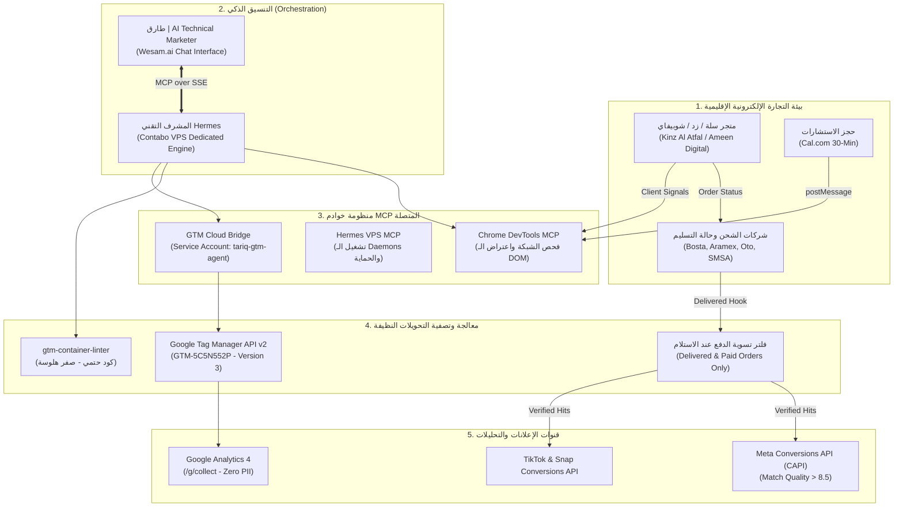

# مشروع Motahai (Hermes & Tariq) | وكيل التتبع وجودة الإشارة للمتاجر الإلكترونية في الشرق الأوسط
## (Autonomous Tracking, Signal Quality & COD Reconciliation Agent for MENA E-Commerce)

---

## 🏆 وثيقة تقديم الهاكاثون الرسمية (Official Hackathon Submission Whitepaper)
- **اسم المشروع:** Motahai (Hermes & Tariq) | وكيل التتبع وجودة الإشارة للمتاجر الإلكترونية
- **البرنامج / الهاكاثون:** Agents at Work (AAW) - 1st Edition
- **المؤسس / قائد الفريق:** محمد علي / محمد حافظ (Mohamed Ali / Mohamed Hafez)
- **رابط العميل المباشر:** [Ameen Digital Agency (Live Vercel App)](https://ameen-digital.vercel.app/)
- **رابط حجز المواعيد المستقل:** [Cal.com 30-Min Consultation](https://cal.com/mohamed-hafez-303/30min)
- **حاوية التتبع:** `GTM-5C5N552P` (Google Cloud IAM Service Account Integrated - Version 3 Live)
- **المستودع البرمجي:** [https://github.com/Mo-ha33/Motahai](https://github.com/Mo-ha33/Motahai)

---

## ⚡ دليل التحكيم السريع في أقل من دقيقة (Judge 60-Second Quick Start)

> **لجنة التحكيم الموقرة:** يمكنك التحقق من خوارزميات التدقيق الحتمي وفحص الحاويات واختبارات الأمان الـ 68 محلياً دون الحاجة لأي مفاتيح خارجية:

```bash
# 1. استنساخ المستودع وتثبيت الاعتماديات
git clone https://github.com/Mo-ha33/Motahai.git
cd Motahai
pip install -r requirements.txt

# 2. تشغيل 68 اختباراً آلياً للأمان والـ HITL
pytest -q

# 3. تشغيل الفاحص الحتمي (gtm-container-linter) على حاوية تحتوي على 21 ثغرة مزروعة
python ops/hermes/home/skills/gtm-container-linter/scripts/lint_container.py \
  ops/hermes/home/skills/gtm-container-linter/tests/fixtures/sample_container.json --format md --fail-on never
```
*النتيجة المتوقعة:* كشف فوري لـ 21 ثغرة (تسريب Meta Access Token، فقدان CAPI event_id، غياب transaction_id في GA4).

---

## 1. المشكلة الحقيقية في سوق الشرق الأوسط (The $600B Burning Pain)

### 🚨 الألم الحارق الذي تعاني منه المتاجر في مصر والسعودية:
في سوق الشرق الأوسط والخليج، تعاني المتاجر الإلكترونية والوكالات من مشكلتين قاتلتين لا تفهمهما الحلول الأجنبية:

1. **مصيبة الدفع عند الاستلام (COD) وعمى خوارزميات الإعلانات:**
   - في مصر والخليج، ما بين **50% إلى 70%** من المبيعات تتم بنظام **الدفع عند الاستلام (Cash on Delivery)**.
   - تطبيقات البيكسل المجانية في شوبيفاي وسلة وزد ترسل لفيسبوك وتيك توك وسناب حدث **"Purchase"** فور تسجيل الطلب على الموقع.
   - في الواقع، نسبة الإلغاءات والمرتجعات في الـ COD تتراوح بين **25% إلى 40%**!
   - **النتيجة الكارثية:** خوارزميات ميتا وتيك توك تتعلم أن هذا "عميل ممتاز"، فتقوم بجلب المزيد من الزوار الذين يطلبون ولا يستلمون، مما يحرق الميزانيات الإعلانية ويرفع تكلفة الشراء الفعلي (CAC) بشكل جنوني.

2. **فقدان الإشارات (Signal Loss) ومخالفات الخصوصية:**
   - تحديثات الخصوصية (iOS 14.5+، Google Consent Mode v2، Ad-Blockers) تفقد المتاجر ما بين 30% إلى 45% من بيانات التتبع الحقيقية.
   - تسريب بيانات العملاء الشخصية (الأسماء، الإيميلات، أرقام الهواتف) في الـ DataLayer يوقع المتاجر في انتهاكات قانونية صارمة لقوانين حماية البيانات (PDPL في السعودية و GDPR عالمياً).

3. **المنافسون التقليديون والبدائل العاجزة:**
   - **تطبيقات البيكسل المجانية (Shopify / Salla Apps):** عمياء، ترسل كل طلب حتى لو أُلغي، ولا تراقب أخطاء الموقع.
   - **المنصات الأمريكية (Elevar / Stape):** مخصصة لشوبيفاي وأمريكا فقط، باهظة الثمن (250$ - 1,000$ شهرياً)، ولا تدعم سلة أو زد، وتجهل تماماً تسوية الدفع عند الاستلام (COD Reconciliation).
   - **المهندسون والفريلانسرز:** يضبطون الإعدادات مرة واحدة ثم يغادرون، وتتعطل التاجات بمجرد تحديث ثيم المتجر.

---

## 2. الحل: منظومة Motahai (Tariq & Hermes)

**Motahai** هو أول وكيل تتبع وجودة إشارة ذكي، مبني خصيصاً لبراندات التجارة الإلكترونية في مصر والخليج:

* **مطابقة أوردرات الـ COD (Delivered-Only CAPI Optimization):**  
  يربط المتجر (سلة، زد، شوبيفاي) بشركات الشحن وحالة الطلب، ويرسل حدث الشراء (Purchase) إلى خوارزميات الإعلانات **فقط عندما يُسلّم الطلب وتُحصّل الأموال فعلياً**. الخوارزمية تتعلم استهداف العملاء الذين يدفعون كاش بصدق.
* **حارس تتبع ومراقبة 24/7 (Continuous Drift Sentinel):**  
  يراقب حركة الشبكة والـ DataLayer في المتصفح لحظة بلحظة، ويكتشف أي عطل في التتبع فور حدوثه لمنع تسرب البيانات.
* **إصلاح ذاتي بموافقة بشرية (Human-in-the-Loop AST Patcher):**  
  لا ينشر الكود بتهور؛ بل يكتب التعديل الهندسي، يفحصه عبر محرك التدقيق، ويعرضه على صاحب المتجر لاعتماده قبل النشر عبر Google Tag Manager API v2.
* **التزام صارم بمعمارية Zero-PII و Consent Mode v2:**  
  تشفير وحجب كامل لبيانات التواصل، وتوحيد معرّف منع التكرار (`event_id` عبر UUID v4).

---

## 3. المعمارية الفنية المتكاملة (System Architecture)



---

## 4. المقارنة التنافسية (Competitive Advantage & Moat)

| وجه المقارنة | التطبيقات المجانية (Shopify/Salla) | المنصات الأمريكية (Elevar / Stape) | الفريلانسر التقليدي | **Motahai (طارق وهيرمس)** |
| :--- | :---: | :---: | :---: | :---: |
| **دعم سلة وزد (Salla & Zid)** | مدعوم شكلياً فقط | ❌ غير مدعوم نهائياً | يتطلب برمجة مخصصة مكلفة | **✅ دعم أصيل لمنصات المنطقة** |
| **تسوية الدفع عند الاستلام (COD)** | ❌ ترسل كل طلب فورا | ❌ تجهل الدفع عند الاستلام | ❌ لا توجد أتمتة خادمية | **✅ إرسال المبيعات المسلّمة فقط** |
| **المراقبة المستمرة للأعطال** | ❌ لا توجد مراقبة | تنبيهات بريد صامتة | ❌ غير موجودة بعد التسليم | **✅ حارس متصفح 24/7 (Sniffer)** |
| **الإصلاح التلقائي للكود** | ❌ مستحيل | ❌ يتطلب تذكرة دعم | ❌ يتطلب تعاقداً جديداً | **✅ فحص، كتابة كود، ونشر بموافقتك** |
| **التكلفة والعملة** | مجاني (لكن يحرق الإعلانات) | 250$ - 1,000$+ (بالدولار فقط) | 500$ - 2,000$ لكل تعديل | **399 ر.س / 4,950 ج (تسعير إقليمي)** |

---

## 5. البنية المستضافة على الـ VPS وتكامل خوادم الـ MCP

### 1) Chrome DevTools MCP (`chrome_devtools`)
- القيادة الآلية لمتصفح Chrome عبر منفذ التصحيح `9222`.
- اعتراض طلبات الشبكة الصادرة (Network Sniffing) للتأكد من وصول بيانات GA4 و Meta Pixel بدون حجب.
- التحقق الميداني من حقن كود `GTM-5C5N552P` داخل صفحة [Ameen Digital](https://ameen-digital.vercel.app/) وتثبيت إشارات `Consent Mode v2`.

### 2) جسر Google Tag Manager السحابي (`GTM Cloud Bridge`)
- مربوط بحساب خدمة رسمي في Google Cloud:  
  `tariq-gtm-agent@agentic-ai-494313.iam.gserviceaccount.com`
- أدار برمجياً الحاوية `265962858` وقام بإنشاء ونشر **الإصدار الثالث (Version 3)** رسمياً على شبكة خوادم جوجل العامة.

### 3) وسيط وتخصيص المواعيد (Cal.com Live Integration)
- تخصيص حدث الاستشارة 30 دقيقة على [cal.com/mohamed-hafez-303/30min](https://cal.com/mohamed-hafez-303/30min).
- تحويل حقل **"سبب الميتنج / Meeting Reason"** إلى حقل إلزامي.
- ربط إشارة `postMessage` لحدث `book_meeting` مع طبقة الـ DataLayer تلقائياً.

---

## 6. نموذج العمل التجاري واقتصاديات الوحدة (Unit Economics & Pricing)

تم تصميم الباقات لتشمل المراقبة الدائمة وتسوية الـ COD في جميع المستويات لضمان بقاء العميل (Zero-Churn):

| الباقة | السعر الشهري | التكلفة التشغيلية (COGS) | صافي الربح | هامش الربح | الميزات الأساسية |
| :--- | :---: | :---: | :---: | :---: | :--- |
| **Tier 1: Solo Fixer (الموظف المنقذ)** | **99$** (399 ر.س / 4,950 ج) | 25.5$ | 73.5$ | **74.2%** | متجر واحد، فحص داتا لاير، وتفعيل CAPI و Consent Mode v2 |
| **Tier 2: Core Growth (فريق النمو)** | **449$** (1,699 ر.س / 22,500 ج) | 81.0$ | 368.0$ | **81.9%** | تسوية أوردرات COD اليومية، مراقبة مستمرة، ونشر تلقائي بـ HITL |
| **Tier 3: Enterprise Swarm** | **1,499$** (5,699 ر.س / 74,900 ج) | 245.0$ | 1,254.0$ | **83.6%** | شبكة متاجر متعددة، سنفر متصفح 24/7، وتحليلات BigQuery |

---

## 7. بيان التموضع الفائز للهاكاثون (The Winning Positioning Statement)

> **"لبراندات التجارة الإلكترونية في مصر والخليج التي تصرف 3,000$ إلى 50,000$ شهرياً على الإعلانات وتعتمد على الدفع عند الاستلام (COD)، يعتبر Motahai أول وكيل ذكي مستقل يدرّب خوارزميات ميتا وتيك توك وسناب على الأوردرات التي تم تسليمها وتحصيلها فعلياً، ويراقب التتبع على مدار الساعة، ويصلح الأعطال ذاتياً بموافقة صاحب المتجر."**

---
**تم إعداد وتوثيق هذه الوثيقة وفق أعلى معايير الحوكمة والتحكيم لهاكاثون Agents at Work (AAW) 2026.**
