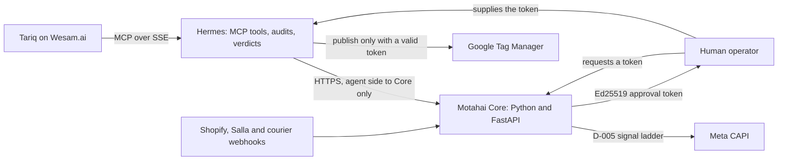
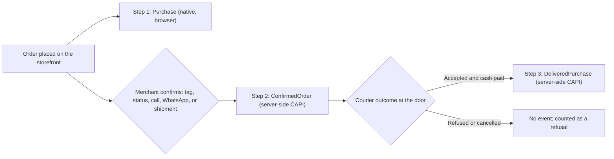

# Motahai (مُتاح)

**An AI go-to-market workforce for cash-on-delivery (COD) e-commerce in MENA and the GCC: Tariq on Wesam.ai and the Hermes agent runtime, with conversion events and production changes gated by a deterministic COD reconciliation core.**
The core tells Meta which orders were confirmed and which were actually delivered and paid, so ad optimization stops
learning from orders that are refused at the door.


---

## The problem

In Cash on Delivery markets (Saudi Arabia, UAE, Egypt, Kuwait) a large share of placed orders is refused at the
door, faked or cancelled in transit. Industry sources often cite 20 to 45 percent; Motahai has not measured this rate
on its own pilot stores yet. Standard tracking fires a Meta `Purchase` the moment checkout completes, so:

- Meta optimizes toward people who press "Order Now" easily, including people who never intended to pay the courier.
- Ads Manager can show a strong ROAS while refused parcels and return shipping eat the cash.
- The naive fix, delaying `Purchase` until delivery 3 to 7 days later, starves ad sets of events (Meta's guideline is
  roughly 50 events per ad set per week) and runs into Meta's 7-day limit on event age.

## Agent architecture

Motahai has three layers. The agents propose and gather evidence; the deterministic core and a human decide.



| Layer | Role | What it can and cannot do |
|---|---|---|
| **Tariq** (Wesam.ai) | AI technical marketer on the Wesam.ai platform. It works through its chat interface and reaches Hermes over MCP. It also prepares client deliverables such as the tracking asset matrix ([`asset_matrix.py`](src/ameen_workforce/asset_matrix.py)). | **Can** ask Hermes for tracking verdicts and evidence. **Cannot** reach Core's database or keys, and cannot mint an approval; it only sees the tools the MCP gateway policy grants. |
| **Hermes** (agent runtime) | Self-hosted runtime that exposes tools over the Model Context Protocol (MCP): consults and verdicts, code audits, allowlisted skills such as the GTM container linter, and browser evidence collection behind SSRF limits. Its memory index carries the D-005 rule. | **Can** execute allowed tools, check tracking signals and verify an approval token. **Cannot** sign a token (it holds only the Ed25519 public key), cannot publish to GTM without a valid token, and cannot use the human-only tools (terminal, memory update, skill creation). Gateway policy: [`tool-policy.yaml`](ops/hermes/gateway/tool-policy.yaml). |
| **Motahai Core** (Python, FastAPI) | Deterministic guardrail engine with no LLM in the money path: the Rule D-005 signal ladder, the Ed25519 human-approval gate (D-003) and the Fernet vault (D-006). | **Can** decide whether a Meta event is sent, and issue approval tokens to an authenticated human operator. **Cannot** be overridden by an agent: Core never relies on a Hermes answer for a money-path decision. |

Agents act without a human in the loop only inside these limits. A live Google Tag Manager publish needs a token that a human
operator minted for one container and one workspace (see [Security and zero trust](#security-and-zero-trust)).
Agent runtime details: [`ops/hermes/`](ops/hermes/README.md). Host isolation: [`deployment/isolation/`](deployment/isolation/README.md).

## The 3-step signal ladder (Rule D-005, "Coexist")

Motahai leaves the merchant's native `Purchase` alone and adds two custom server-side events. Buyers optimize on the
deepest step that still gives their ad sets enough volume.



| Step | Event | Trigger | What Motahai sends |
|---|---|---|---|
| 1 | `Purchase` | Checkout submit | Nothing. The merchant's own Shopify or Salla Meta integration sends it; Motahai never does, so there is no double counting. |
| 2 | `ConfirmedOrder` | Merchant tag, merchant-configured status, manual trigger, or shipment (`implicit_on_ship`, on by default) | Server-side CAPI, `event_id = confirmed_<order_id>`, `event_time` = confirmation time, value = order total. |
| 3 | `DeliveredPurchase` | Courier reports delivery and cash is collected, after a settlement window (default 12 h) | Server-side CAPI, `event_id = delivered_<order_id>`, `event_time` = **order placement time**, value = net collected (order total minus successful refunds on Shopify). |

Details that keep the ladder honest:

- Customer identifiers (phone, email, name, city, country, postcode, external ID) are normalized and SHA-256 hashed
  before they leave the server. Phone numbers are normalized to E.164 first.
- Meta rejects a whole request if any `event_time` is older than 7 days. An order whose delivery would land at
  placed + 6.5 days or later is recorded as `late_delivery` and never sent.
- Cancelled, voided and fully refunded orders never produce a `DeliveredPurchase`. Refusals feed a hashed exclusion
  list (customers with 2 or more refusals in 180 days) and a hashed seed list of delivered buyers.
- Tenants start in `shadow` mode: events are computed and recorded but nothing is sent to Meta until the operator
  switches the tenant to `live`.

Full specification, state machine and event matrix: [`docs/MOTAHAI_PLAYBOOK.md`](docs/MOTAHAI_PLAYBOOK.md).
Media-buyer setup (custom conversions, bidding phases): [`docs/pilot/media_buyer_handbook.md`](docs/pilot/media_buyer_handbook.md).

## Platforms and couriers

| | Bosta (Egypt) | OTO (KSA and GCC aggregator) |
|---|---|---|
| **Shopify** | Supported | Supported |
| **Salla** | Supported | Supported |

| Layer | How it works |
|---|---|
| Order source | Signed order webhooks from Shopify (`X-Shopify-Hmac-Sha256`) and Salla (`X-Salla-Signature`). |
| Courier status | `POST /webhooks/bosta/{shop_domain}` (delivered = state 45) and `POST /webhooks/oto/{shop_domain}` (delivered status; HMAC over `orderId:status:timestamp`). |
| Attribution capture | Storefront snippets for [Shopify](storefront/shopify/README.md) and [Salla](storefront/salla/README.md) capture `_fbp`, `_fbc`, `fbclid` and UTM parameters. Captures are quarantined and merged into an order only when the signed order webhook exists, the tenant matches and the order total matches. |
| Tenant isolation | The tenant comes from the shop domain in the URL or signed headers, never from the order id. Courier webhook secrets are per tenant and stored encrypted; a tenant without a secret gets `401`. Every order, event and credential row is keyed by tenant. |

Torod and SMSA couriers are not implemented.

## Security and zero trust

| Control | What it does |
|---|---|
| **Ed25519 human-in-the-loop gate (D-003)** | No live Google Tag Manager publish goes through without a token a human operator mints through `POST /approvals/gtm-publish`. The token is Ed25519-signed, bound to one container and one workspace, single-use and valid for 30 minutes. The verifier holds only the public key, so a compromised agent host cannot mint approvals. There is no HMAC fallback. Code: [`src/ameen_workforce/hitl_tokens.py`](src/ameen_workforce/hitl_tokens.py). |
| **Fernet identity vault (D-006)** | Checkout IP and user agent are stored Fernet-encrypted and decrypted only when the CAPI payload is built. They are purged after a successful live `DeliveredPurchase`, or 14 days after capture. Platform and Meta credentials use the same vault and fail closed if `MOTAHAI_FERNET_KEY` is missing. Code: [`credentials.py`](src/ameen_workforce/credentials.py), [`checkout_context.py`](src/ameen_workforce/checkout_context.py). |
| **Host isolation** | The money path (API, scheduler, Postgres, Fernet key, Ed25519 private key) runs as a separate user or container from the LLM runtime, which holds only the public key and a scoped service token. Compose file, systemd units and secrets inventory: [`deployment/isolation/`](deployment/isolation/README.md). |
| **Webhook verification** | HMAC checks over the raw request bytes in constant time; a missing secret or header fails closed with `401`. OTO's signed timestamp must be fresh (default one hour) and Bosta secrets must be at least 24 characters. Deliveries are recorded by payload hash and are idempotent. Code: [`webhook_signatures.py`](src/ameen_workforce/webhook_signatures.py). |
| **Durable webhook staging** | A verified webhook is stored Fernet-encrypted before the `200` goes out (`503` if it cannot be stored, so the platform retries). The row is deleted once processed; a lost or failed background task is replayed by the scheduler, and after 5 failures it becomes a dead letter with its payload wiped. Code: [`webhook_staging.py`](src/ameen_workforce/webhook_staging.py). |

Vulnerability reporting and the supported-versions policy: [`SECURITY.md`](SECURITY.md).

## Verified evidence

**Test suite.** `574 passed, 3 skipped` on Windows with Python 3.12. The 3 skips are POSIX file-permission tests.

```bash
python -m pytest -q          # about 80 seconds
```

**Sunday Signal Hygiene digest.** A weekly email per merchant, sent on Sunday from 10:00 in the tenant's timezone
(Arabic by default, English available) by the scheduler. Every number comes from a named SQL query over the tenant's
own rows (`q_week_orders`, `q_cohort_delivery`, `q_refused_cod`, `q_signal_health`, `q_creatives`,
[`digest.py`](src/ameen_workforce/digest.py)). There is no LLM in the path and no default or canned figure; missing
data is printed as "no data yet". It reports placed, confirmed and delivered orders, delivery rate on matured cohorts,
refused COD value, signal health and the best and worst ads by delivery rate. The job is skipped when SMTP is not
configured. Tests: [`tests/test_digest.py`](tests/test_digest.py).

**Pilot simulation.** One command replays four invented Shopify orders through the real pipeline, with no network
access: an in-memory database, a tenant in `shadow` mode, a sender that only records payloads and a throwaway
encryption key.

```bash
python scripts/run_pilot_simulation.py
```

It prints a timeline for each order and ends with this summary (exit code 0):

```
SUMMARY (all events are shadow or held: nothing reached Meta)
  Order     Scenario                                                      ConfirmedOrder    DeliveredPurchase             Value sent
  SIM-1001  COD confirmed by tag, then delivered                          shadow            shadow                        1250.00
  SIM-1002  COD shipped, then refused (cancelled after shipping)          shadow            none (cancelled)              -
  SIM-1003  Prepaid order, paid (no checkout user agent captured)         shadow            shadow                        1250.00
  SIM-1004  COD delivered after the placed+6.5d cutoff (late_delivery)    shadow            late_delivery (never sent)    1250.00

Meta calls made: 0 (recording sender invoked 0 times; tenant mode is shadow).
```

A refused order never reaches `DeliveredPurchase`, and a parcel delivered after the cutoff is held back instead of
being rejected by Meta. The live pilot-account validation plan is in
[`docs/pilot/S2-7_validation_plan.md`](docs/pilot/S2-7_validation_plan.md).

## Quickstart: local simulation in 30 seconds

```bash
git clone https://github.com/Mo-ha33/Motahai.git
cd Motahai
python -m venv .venv
# Windows: .venv\Scripts\activate      macOS/Linux: source .venv/bin/activate
pip install -r requirements.txt

python scripts/run_pilot_simulation.py     # the four-order ladder simulation above
python -m pytest -q                        # full suite
```

No `.env` is needed for either command. Running the real service needs per-tenant configuration; see
[`deployment/isolation/`](deployment/isolation/README.md) for the environment templates and
[`docs/RUNBOOK.md`](docs/RUNBOOK.md) for operations.

## Repository map

```
.
├── src/ameen_workforce/        Engine: CAPI sender, order pipeline, webhooks, capture, scheduler, digest, HITL tokens, vault
├── scripts/                    onboard_store.py (operator CLI), run_pilot_simulation.py
├── storefront/                 Capture snippets for Shopify and Salla
├── tests/                      Engine tests (pipeline, couriers, digest, HITL tokens, capture, onboarding)
├── deployment/                 isolation/ (Core vs agent runtime), systemd/, nginx/, contabo/, dns/
├── ops/hermes/                 Optional MCP agent runtime: gateway policy, linter skill, LLM router
│   └── consultation.py         MCP tool module; verifies the D-003 approval token before a live GTM publish
├── tools/
│   └── board/                  manage_board.py: project-board helper
├── cloudflare-browser-mcp/     Cloudflare Worker exposing Playwright as an MCP server
├── docs/                       Playbook, runbook, pilot handbook, commercial docs, research notes
├── LICENSE                     BUSL-1.1 (converts to Apache-2.0 on 2030-10-10)
└── SECURITY.md                 Vulnerability reporting
```

---

## ملخص تنفيذي بالعربية

**Motahai (مُتاح)** محرك خادمي لمطابقة التحويلات والتسليم في التجارة الإلكترونية التي تعتمد على الدفع عند الاستلام (COD)
في منطقة الشرق الأوسط وشمال أفريقيا ودول الخليج. تشير تقديرات القطاع إلى أن نسبة كبيرة من هذه الطلبات، تتراوح غالباً
بين 20% و45%، تُرفض عند الباب، فتتعلم خوارزمية Meta من عمليات `Purchase` لم يُدفع ثمنها فعلياً. يعتمد النظام «سلّم
الإشارات» ذا الخطوات الثلاث (القاعدة D-005): يبقى `Purchase` الأصلي من المتجر كما هو، ثم يُرسَل `ConfirmedOrder`
عند تأكيد الطلب، ثم `DeliveredPurchase` عند التسليم وتحصيل المبلغ، عبر Conversions API من الخادم مع تجزئة معرّفات
العميل بخوارزمية SHA-256. يدعم النظام منصتَي Shopify وSalla، وشركتَي الشحن Bosta (مصر) وOTO (السعودية ودول الخليج)،
مع عزل كامل لبيانات كل متجر. على صعيد الأمان، لا يُنشر أي تعديل مباشر على Google Tag Manager دون رمز موافقة بشري
موقّع بخوارزمية Ed25519، وتُخزَّن بيانات الاتصال بالعميل مشفّرة بـ Fernet وتُحذف بعد الإرسال أو بعد 14 يوماً،
ويُفصل مسار المال عن بيئة الذكاء الاصطناعي. وتتألف طبقة الوكلاء من ثلاثة مستويات: «طارق» (Tariq) وكيل التسويق التقني على منصة Wesam.ai، ووقت التشغيل Hermes الذي يتيح الأدوات عبر بروتوكول سياق النموذج (MCP) ولا يملك سوى المفتاح العام، ثم نواة Motahai الحتمية المبنية بلغة Python التي تفرض القواعد؛ فالوكلاء يقترحون، أما القرار فللنواة والإنسان. أما الأدلة، فقد اجتاز النظام 574 اختباراً آلياً مع تخطي 3 اختبارات،
ويُرسل رسالة «ملخص نظافة الإشارة» كل أحد بالبريد الإلكتروني اعتماداً على استعلامات SQL فقط، ويمكن تشغيل محاكاة
كاملة بأمر واحد دون أي اتصال بالإنترنت.

---

## License

Motahai is licensed under the Business Source License 1.1 ([`LICENSE`](LICENSE)). On 2030-10-10 the license converts
to Apache-2.0. Read `LICENSE` for the exact terms of permitted use before that date.

## Security

Please report vulnerabilities privately as described in [`SECURITY.md`](SECURITY.md). Do not open public issues for
security reports.
