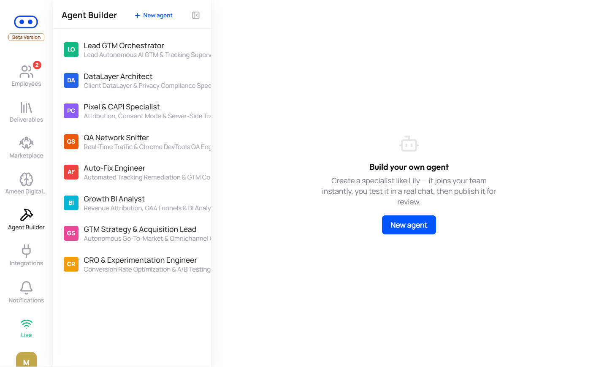
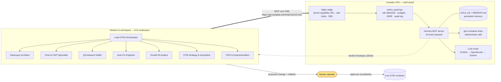
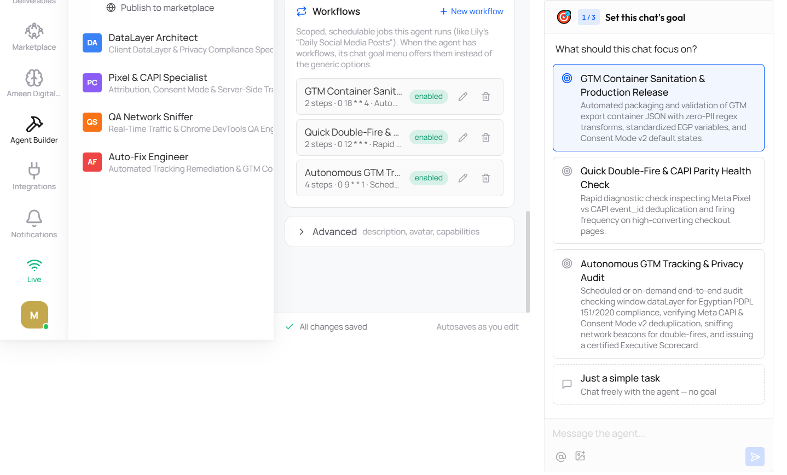
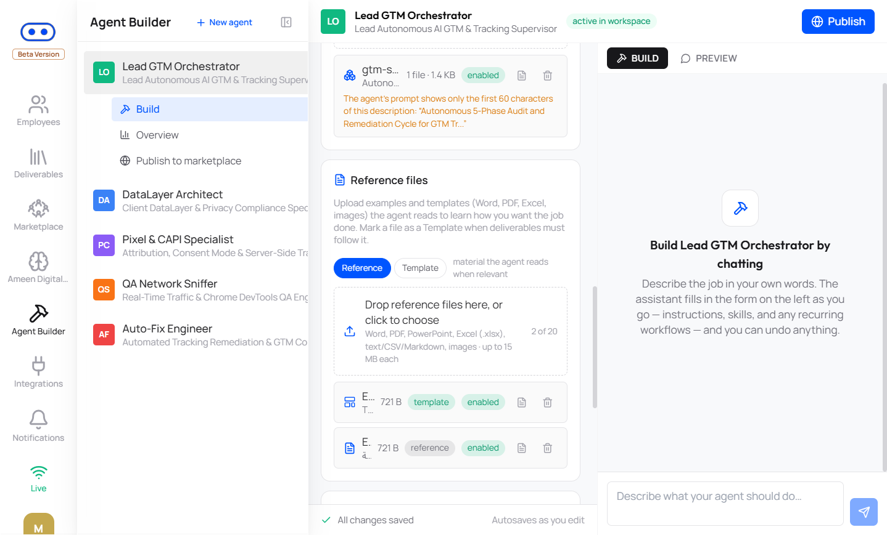

# Motahai (متاح) — An 8-Agent GTM & Tracking Workforce with a Self-Hosted Technical Supervisor

> **Agents propose. Deterministic code verifies. Humans approve.**
> Eight AI employees on [Wesam.ai](https://wesam.ai) audit, fix and QA e-commerce tracking (GTM, GA4, Meta CAPI,
> Consent Mode v2). Every one of them works through **Hermes**, a technical supervisor we host on our own
> Contabo VPS and expose to Wesam over the **Model Context Protocol (MCP)**. Nothing reaches a production
> GTM container without explicit human sign-off.

Built for **Untap — Agents at Work (1st Edition)** by **Ameen Digital** · [Verify in 60 seconds](#verify-in-60-seconds)

> **بالعربي:** متاح فريق من 8 موظفين ذكاء اصطناعي على منصة Wesam متخصصين في تتبع التجارة الإلكترونية
> (GTM و GA4 و Meta CAPI و Consent Mode v2). كلهم بيشتغلوا تحت إشراف **Hermes**، مشرف تقني مستضاف على سيرفر
> خاص بينا ومتوصل بيهم عن طريق **MCP**. الوكلاء بيقترحوا، والكود الحتمي بيتحقق، والإنسان هو اللي بيوافق:
> مفيش أي تعديل بيوصل لحاوية GTM حية من غير موافقة بشرية صريحة.



---

## Why this is not "just a system prompt"

| A prompt-only agent              | Motahai                                                                                   |
|----------------------------------|-------------------------------------------------------------------------------------------|
| Lives only inside the platform   | **Hermes runs on our own VPS** and is wired into every Wesam agent as an MCP server        |
| The LLM grades its own output    | **Deterministic `gtm-container-linter`** (stdlib Python, no LLM): same input → same findings |
| Can ship whatever it writes      | **3 HITL gates**: workforce engine halt · Hermes `REJECTED`/`BLOCKED` verdicts · gateway tool policy |
| Forgets between chats            | **Persistent memory** on the VPS: `SOUL.md`, `MEMORY.md`, standing decisions (`D-001…D-004`) |
| One model, one point of failure  | **LLM router** with failover (NVIDIA → OpenRouter → Gemini) and a stale-if-error cache     |
| "Trust me"                       | **68 automated tests** + a reproducible evidence script that writes a timestamped JSON report |

---

## Architecture



**How it fits together**

1. **Wesam.ai** hosts the 8 AI employees (instructions, workflows, chat). Wesam's MCP connector is shared by the
   whole workspace, so **every agent sees the same 18 Hermes tools** in its tool list.
2. **Hermes** is the technical supervisor ("CTO / Senior Tracking Architect"). It runs on our VPS, loads
   [`SOUL.md`](ops/hermes/home/SOUL.md) (identity, engineering standards, refusal rules) and
   [`MEMORY.md`](ops/hermes/home/MEMORY.md) (standing decisions) into every session, and answers in a strict
   JSON **Verdict Envelope** that downstream agents parse.
3. **The connection** is MCP over SSE. Wesam can only take a URL (no custom headers), so the URL carries a
   64-hex secret: Nginx accepts only `/mcp/<secret>/`, injects the bearer token for the gateway, keeps the
   secret out of logs, and returns 404 for everything else under `/mcp/`
   ([`gateway/nginx-mcp.conf`](ops/hermes/gateway/nginx-mcp.conf), [`deploy/mcp-capability.conf.tpl`](ops/hermes/deploy/mcp-capability.conf.tpl)).
4. **The gateway** ([`policy_guard.py`](ops/hermes/gateway/policy_guard.py) + [`tool-policy.yaml`](ops/hermes/gateway/tool-policy.yaml))
   enforces what each role may call, rate limits, timeouts, token budgets, SSRF blocking, and an audit log
   that stores argument hashes, never values.

---

## The 18 Hermes tools the Wesam agents use

Hermes has 21 tools. **18 are exposed to the Wesam workspace; 3 are human-only** (SSH tunnel, never through
the public URL), because they can change Hermes's future behaviour or touch the host.

| Group | Tools | What the agents use them for |
|---|---|---|
| **Advice & review** | `hermes_consult`, `hermes_audit_code` | Engineering verdicts; code review of every patch before it leaves the swarm |
| **Deterministic skills** | `hermes_run_task`, `hermes_skill_execute`, `hermes_skills_list`, `hermes_skill_get` | Run allowlisted skills on the VPS, e.g. `gtm-container-linter` on a live container version |
| **Memory (read)** | `hermes_memory_read`, `hermes_session_search` | Recall standing decisions, client ledger, past incidents |
| **Research** | `hermes_web_search`, `hermes_web_extract` | Vendor docs and public pages (SSRF-checked, treated as untrusted data) |
| **Evidence browser** | `hermes_browser_navigate`, `_snapshot`, `_screenshot`, `_scroll`, `_click`, `_type`, `_evaluate`, `_close` | Capture `window.dataLayer`, fired beacons and page state on the client's site |
| ~~Human-only~~ | `hermes_terminal_exec`, `hermes_skill_create`, `hermes_memory_update` | **Not exposed.** Agents propose memory writes via the `memory_write` field; a human applies them |

### Who calls what

Request/verdict contracts and JSON-RPC recipes are in the [agent SOP](ops/hermes/sop/WESAM_AGENT_SOP.md).

| Wesam agent | Typical Hermes call | Why |
|---|---|---|
| Lead GTM Orchestrator | `hermes_consult` | Sequencing (audit → fix → QA) and go/no-go verdicts |
| DataLayer Architect | `hermes_browser_evaluate` → `hermes_consult` | Capture the real `dataLayer` payload, then get a schema ruling |
| Pixel & CAPI Specialist | `hermes_consult` | `event_id` parity browser ↔ server (decision **D-002**) |
| QA Network Sniffer | `hermes_browser_*` | Evidence of what actually fires, and how often |
| Auto-Fix Engineer | `hermes_audit_code` | Every patch is reviewed. Deliberately **no** execution tools: the code writer never runs code on the VPS |
| Growth BI Analyst | `hermes_memory_read`, `hermes_consult` | Attribution rules and known data-quality incidents |
| GTM Strategy & Acquisition Lead | `hermes_consult`, `hermes_web_search` | Channel and platform constraints |
| CRO & Experimentation Engineer | `hermes_consult` | Experiment tracking design that won't break dedup |

Container audits go through `hermes_run_task` / `hermes_skill_execute` with the `gtm-container-linter`
skill: SOUL §4 makes Hermes answer `NEEDS_EVIDENCE` to any audit request that has no linter report.

---

## Human-in-the-loop: three independent gates

| Gate | Where | What it stops |
|---|---|---|
| **1. Workforce engine** | [`src/ameen_workforce/hitl_escalation.py`](src/ameen_workforce/hitl_escalation.py) | Payment, confidential/legal and irreversible tasks (e.g. *delete container*) halt in `AWAITING_HITL_APPROVAL` until a supervisor resolves them via `POST /escalations/{id}/resolve` |
| **2. Hermes verdicts** | [`SOUL.md` §4](ops/hermes/home/SOUL.md), decision **D-003** | Any proposal to publish to a live container or theme, disable consent checks, remove dedup, hard-code secrets, or ship without a rollback → `REJECTED` / `BLOCKED` |
| **3. Gateway policy** | [`policy_guard.py`](ops/hermes/gateway/policy_guard.py), [`tool-policy.yaml`](ops/hermes/gateway/tool-policy.yaml) | Shell, skill creation and memory writes are unreachable from the public URL; per-tool rate/time/token limits; private-IP browsing blocked |

Every verdict that proposes a change must carry an applicable `diff` **and** a `rollback`
([Verdict Envelope](ops/hermes/home/SOUL.md#7-output-contract--the-verdict-envelope)).

---

## Verify in 60 seconds

Requires Python 3.11+.

```bash
pip install -r requirements.txt
pytest -q                                   # 68 passed

# Deterministic linter on a container with planted defects
python ops/hermes/home/skills/gtm-container-linter/scripts/lint_container.py \
  ops/hermes/home/skills/gtm-container-linter/tests/fixtures/sample_container.json --format md --fail-on never

# Offline proof: exact counts, clean container = 100/100, live mutation = exactly 2 new findings
python ops/hermes/demo/competition_demo.py --only 3
```

Expected linter result on the broken fixture: **health 0/100 · critical 1 · high 8 · medium 8 · low 4**,
including a leaked Meta access token in client-side HTML, a Meta Purchase without `eventID` (CAPI dedup
impossible), a GA4 purchase without `transaction_id`, and exact-duplicate tags. A recorded run is in
[`docs/evidence/`](docs/evidence/).

The live proofs (Hermes over MCP: SOUL fingerprint, memory canary **D-002**, refusal of a live publish, SSRF
and tool-catalogue checks) need the secret URL and are described in [`ops/hermes/demo/DEMO.md`](ops/hermes/demo/DEMO.md).

---

## Repository map

```
.
├── src/ameen_workforce/         Workforce engine (FastAPI): workflows, HITL escalation, Hermes bridge, beacon sniffer
├── run_workforce_cli.py         Interactive CLI to run a workflow and watch a HITL escalation halt it
├── tests/                       Engine tests (HITL, workflows, API, PII detection)
├── ops/hermes/                  Everything deployed to the VPS
│   ├── home/SOUL.md             Hermes identity, engineering standards, refusal rules, Verdict Envelope
│   ├── home/MEMORY.md           Always-loaded memory index + standing decisions D-001…D-004
│   ├── home/memories/           Client ledger template, battle-tested GTM patterns, incident log
│   ├── home/skills/             gtm-container-linter (built + tested) and specs for 4 more skills
│   ├── gateway/                 policy_guard.py, tool-policy.yaml, nginx-mcp.conf, systemd limits
│   ├── llm-router/              Multi-provider router with failover, circuit breakers, budgets
│   ├── integration/             SOUL + MEMORY injection into every LLM call, with provenance hash
│   ├── deploy/                  Blueprint deploy script with backup, self-test and rollback
│   ├── demo/                    competition_demo.py: proofs → timestamped evidence JSON
│   └── sop/WESAM_AGENT_SOP.md   Request/verdict contracts + JSON-RPC recipes for the Wesam agents
├── cloudflare-browser-mcp/      Cloudflare Worker exposing Playwright as an MCP server
├── deployment/                  Contabo deploy script, Nginx, DNS and systemd units
└── docs/                        Architecture, agent specifications, runbook, screenshots, evidence
```

## Screenshots

| Lead Orchestrator: scheduled workflows | Lead Orchestrator: build view |
|---|---|
|  |  |

---

## Known limitations (stated up front)

- **One connector per workspace.** Wesam shares the MCP connection across all agents, so today the 8 agents
  reach Hermes as one principal. `tool-policy.yaml` already defines per-agent principals, ready for when
  per-agent connectors are available.
- **Role names.** `SOUL.md` and `tool-policy.yaml` use the v1 role names from the original design (e.g.
  *Container Sanitation Auditor*, *Drift Sentinel*); the Wesam roster above is the current one.
- **Free-tier LLMs.** The router degrades gracefully (failover, then a labelled stale cache, then an honest
  `BLOCKED`), but it cannot guarantee availability.
- **Technical, not legal, compliance.** Hermes reports technical conformance with Consent Mode v2 / PDPL
  151/2020; legal questions are escalated to a human.
- **Host hardening** is tracked as a checklist in [`ops/hermes/README.md`](ops/hermes/README.md#d0-threat-model).
  Host-specific values (IPs, ports, secrets) are kept out of this repository by design.

---

## Commercial Packaging & Pricing

Motahai operates on a 3-tier commercial model with an 80%+ gross margin target:

| Tier | Package | Monthly Price | Scope |
|---|---|---|---|
| **Tier 1** | **The Solo Fixer** (باقة الموظف المنقذ) | **$99 / mo** (399 SAR / 4,950 EGP) | 1 AI Employee (Auto-Fix Engineer) for single domains & dropshippers |
| **Tier 2** | **The Core Growth Trio** (باقة فريق التتبع والأداء) | **$449 / mo** (1,699 SAR / 22,500 EGP) | 3 AI Employees (Lead Orchestrator + Auto-Fix + CAPI Specialist) |
| **Tier 3** | **Autonomous Department** (باقة القسم المؤتمت بالكامل) | **$1,499 / mo** (5,699 SAR / 74,900 EGP) | Full 8-Agent Swarm with real-time beacon sniffer & BI |

📖 **Explore Commercial Docs:**
- [Full Pricing & Packaging Playbook](docs/commercial/MOTAHAI_PRICING_PLAYBOOK.md)
- [Unit Economics & Financial Model](docs/commercial/01_unit_economics_model.md)
- [Packaging & Expansion Loops](docs/commercial/05_packaging_and_expansion_loops.md)
- [Sales Battlecards & Discovery Scripts](docs/commercial/06_sales_battlecards_and_scripts.md)

---

## Autonomous Video Production Pipeline

In addition to GTM tracking, the workforce integrates an enterprise video generation extension:
- **10-Second Modular Blocks:** Calibrated to 18–20 words per block with a 2-second audio buffer.
- **Brand Governance:** Strict HEX palette enforcement and 3D character consistency.
- **Production Artifacts:** Automated generation of Omni visual prompts, BPM-curved audio prompts, per-block JSON manifests, and synchronized `.srt` subtitles.

📖 Read the full [Video Production Pipeline Specification](docs/VIDEO_PRODUCTION_PIPELINE.md).

---

## Further reading

- [Architecture & HITL state machine](docs/ARCHITECTURE.md) · [Agent specifications](docs/AGENTS_SPECIFICATION.md) · [Runbook](docs/RUNBOOK.md)
- [Hermes supervisor blueprint & security policy](ops/hermes/README.md) · [LLM router decision record](ops/hermes/llm-router/README.md)
- [Commercial Playbook](docs/commercial/MOTAHAI_PRICING_PLAYBOOK.md) · [Video Production Pipeline](docs/VIDEO_PRODUCTION_PIPELINE.md)

