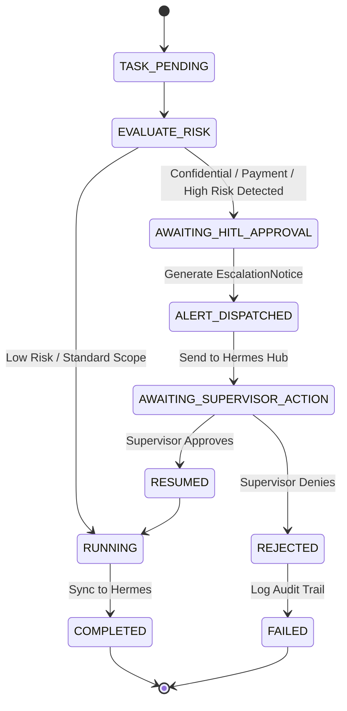

# Ameen Digital AI Workforce — System Architecture & Operating Framework

**Brand:** Ameen Digital AI Employees  
**Agency Umbrella:** [agency.motahai.com](https://agency.motahai.com)  
**Portal Domain:** `https://employees.motahai.com`  
**Builder & Orchestration:** Wesam.ai Platform  
**Supervisor / Hub:** Hermes Autonomous AI Agent (`https://hermes.motahai.com`)  

---

## 1. Executive Summary & Operational Charter

The **Ameen Digital AI Workforce** is an autonomous multi-agent collective operating under the Ameen Digital brand umbrella. Deployed at `https://employees.motahai.com` via Wesam.ai, the workforce executes end-to-end client services, client onboarding, dataLayer architecture, tracking remediation, and growth analytics while maintaining a strict Human-in-the-Loop (HITL) safety perimeter.

---

## 2. Architectural Topology

```
                  [ Clients & Agency Users ]
                              │
                              ▼
                 https://employees.motahai.com
               (CNAME -> cname.wesam.ai Edge)
                              │
               ┌──────────────┴──────────────┐
               ▼                             ▼
       [ Wesam.ai Swarm ]           [ Ameen Workforce Engine ]
    (8 Autonomous Employees)        (FastAPI / HITL Safety Core)
               │                             │
               ├─────────────────────────────┤
               ▼                             ▼
     [ Browser MCP / Tooling ]      [ Hermes Autonomous Hub ]
  (Playwright Cloudflare Worker)   (https://hermes.motahai.com)
                                             │
                                             ▼
                                  [ Human Supervisors ]
                               (WhatsApp / Telegram / Web)
```

---

## 3. Human-in-the-Loop (HITL) Collaboration Protocol

Operating Principle 2 dictates that the AI Workforce collaborates shoulder-to-shoulder with the human team. Automated execution must never make confidential or financial commitments unilaterally.

### Escalation State Machine:



### Escalation Triggers:
1. **Financial & Payment Actions:**
   - Client invoicing, refund processing, credit card charges, budget adjustments, or payout authorizations.
2. **Confidentiality & Legal Decisions:**
   - Non-Disclosure Agreements (NDAs), contracts, client credential disclosure, privacy policy waivers.
3. **High-Impact Operations:**
   - Purging production GTM containers, bulk deleting ad campaigns, or altering live payment gateways.

---

## 4. Hermes Integration & State Pipeline

Operating Principle 3 requires communicating state updates back to Hermes Agent at `https://hermes.motahai.com`.

### Endpoints Interfaced:
| Hermes Endpoint | Method | Purpose |
| :--- | :--- | :--- |
| `/v1/triggers` | `POST` | Dispatches task state changes (`TASK_STARTED`, `TASK_COMPLETED`, `TASK_FAILED`, `HITL_SUPERVISOR_ESCALATION`) |
| `/webhook/agency` | `POST` | Ingests new client onboarding triggers from `agency.motahai.com` |
| `/health` | `GET` | Verifies Hermes node liveness on Contabo VPS (`<VPS_IP>:58763`) |

---

## 5. Domain & DNS Boundary Configuration

- **Target Host:** `employees.motahai.com`
- **DNS Record:** `CNAME`
- **Target Value:** `cname.wesam.ai`
- **Edge Routing:** Terminated with SSL at Wesam edge or optionally reverse-proxied through Contabo VPS via `/etc/nginx/sites-available/employees.motahai.com.conf`.

---

## 6. Verification Status

All core modules have been developed and tested:
- `src/ameen_workforce/config.py`: Environment and boundary configuration.
- `src/ameen_workforce/models.py`: Pydantic domain models for tasks, agents, and escalations.
- `src/ameen_workforce/hitl_escalation.py`: Regex word-bounded safety gatekeeper.
- `src/ameen_workforce/hermes_bridge.py`: Resilient HTTP client syncing to `hermes.motahai.com`.
- `src/ameen_workforce/workflow_engine.py`: Multi-agent orchestration engine.
- `src/ameen_workforce/service.py`: FastAPI gateway service.
- `tests/`: unit & integration tests for HITL escalation, workflows, API and PII detection (run `pytest -q` from the repo root for the full 68-test suite).
