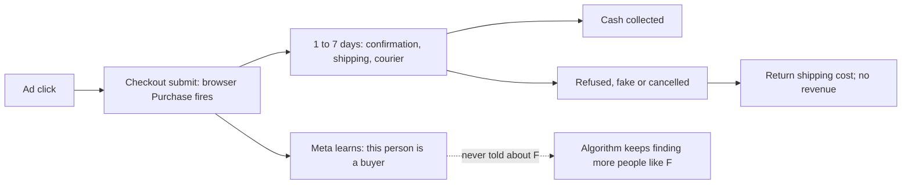
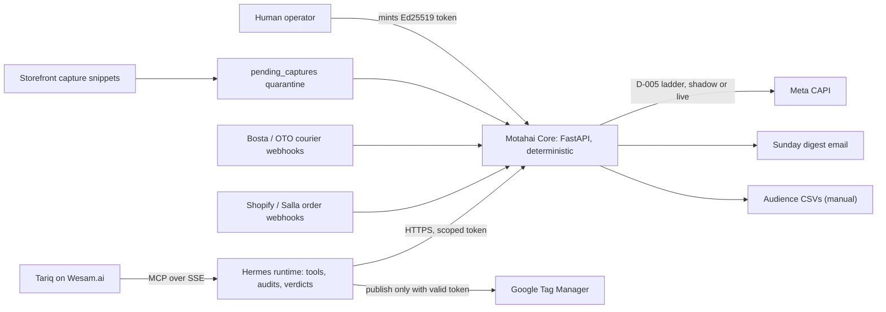

# MOTAHAI_CORE_FOUNDATION

**Strategic, business and technical core audit of Motahai (مُتاح)**
Date: 2026-10-10. Audited against `main` at `0cabdb2`. Test suite re-run for this audit: `577 passed` on Linux, Python 3.12
(the README's `574 passed, 3 skipped` is the Windows run; the 3 POSIX-only permission tests pass here).

This document is the single source of truth for what Motahai is, who it serves, what it sends to ad platforms, and
what the code actually does today. Every technical statement carries a `file:line` reference. Where a planning
document or the brief that commissioned this audit claims something the code does not support, it is called out in a
**Reality check** box and collected in [section 6](#6-claims-the-repository-does-not-support).

Label conventions used throughout:
- **Built**: in the code on `main`, with tests.
- **Partial**: some of it is in the code; the gap is named.
- **Not built**: only in documents.
- **Recommendation**: this audit's proposal, not a decision already recorded.

---

## Contents

1. [The core business model and market reality](#1-the-core-business-model-and-market-reality)
2. [Ad platform alignment and technical compliance](#2-ad-platform-alignment-and-technical-compliance)
3. [The one core problem: the Browser-to-Courier Signal Distortion Gap](#3-the-one-core-problem-the-browser-to-courier-signal-distortion-gap)
4. [The one core solution: Rule D-005 "Coexist" and the 3-step signal ladder](#4-the-one-core-solution-rule-d-005-coexist-and-the-3-step-signal-ladder)
5. [System architecture at a glance](#5-system-architecture-at-a-glance)
6. [Claims the repository does not support](#6-claims-the-repository-does-not-support)
7. [Top 3 high-priority architecture tasks](#7-top-3-high-priority-architecture-tasks)

---

## 1. The core business model and market reality

### 1.1 Target market

E-commerce merchants and the media buyers who run their Meta ads in MENA and the GCC, with Saudi Arabia, the UAE, Egypt
and Kuwait named as the core markets (`README.md:15`, `docs/MOTAHAI_PLAYBOOK.md:3`). The engine supports two storefront
platforms, Shopify and Salla, and two couriers, Bosta (Egypt) and OTO (KSA and GCC aggregator) (`README.md:85-99`).
Torod and SMSA are not implemented (`README.md:99`).

> **Reality check: market coverage is uneven across the four named countries.**
> Phone normalization, which drives Meta matching and the refuser list, only knows Egyptian and Saudi local formats
> (`src/ameen_workforce/capi_service.py:110`, `:113-128`). Verified for this audit:
> - UAE `0501234567` stays `0501234567` (no `971`), so it will not match on Meta.
> - UAE `501234567` (9 digits, no trunk zero) becomes `966501234567`, a **Saudi** number (`capi_service.py:125-127`).
> - Kuwait `99123456` stays unprefixed.
>
> Egypt and KSA are correct. The UAE and Kuwait are not production-ready until this is fixed (Task 2 in section 7).

### 1.2 The Cash-on-Delivery reality

Two facts define the market:

1. **Doorstep refusal and cancellation.** A large share of COD orders are refused at the door, faked or cancelled in
   transit. Industry sources cite 20% to 45%. **Motahai has not measured this on its own pilot stores yet**, and the
   README and playbook say so (`README.md:16`, `docs/MOTAHAI_PLAYBOOK.md:13`). This document uses the range as context
   only, never as a Motahai result. Measuring it is pilot question work in `docs/pilot/S2-7_validation_plan.md`.
2. **Courier cash settlement lag.** The courier collects cash at the door and remits it to the merchant later, net of
   fees and returns. This means "delivered" and "cash in the merchant's bank" are two different moments.

> **Reality check: Motahai models delivery, not courier remittance.**
> `DeliveredPurchase` fires when the courier reports delivery (Bosta state 45, OTO `delivered`) or the merchant marks
> a Shopify COD order paid, followed by a **12-hour hold** called the settlement window
> (`src/ameen_workforce/webhook_listener.py:55-61`, `src/ameen_workforce/order_pipeline.py:172-175`). That window guards
> against quick reversals. It is not a reconciliation against the courier's cash remittance. The remittance CSV import
> listed on the board (S2-5, `PROJECT_BOARD.md:51`) is not in the code: there is no remittance or settlement-file
> parser anywhere under `src/`.

### 1.3 Client retention and anti-churn: from one-time GTM setup to recurring SaaS

**The structural problem.** A GTM setup, container sanitation or pixel audit is a project. Once it is done the client
has little reason to keep paying, and the deliverable (a clean container, a taxonomy sheet from
`src/ameen_workforce/asset_matrix.py`) keeps working without Motahai.

**The structural answer.** The COD reconciliation engine is continuous by nature. Its value is produced per order, every
day, and it stops the day the subscription stops:

| What the client gets every week | Why it disappears if they churn | Code status |
|---|---|---|
| `ConfirmedOrder` and `DeliveredPurchase` events feeding the ad sets they optimize on | Their optimization goal goes silent and the ad sets fall back to native `Purchase` | **Built** (`order_pipeline.py`, `capi_service.py`) |
| Refuser exclusion list and delivered-buyer seed list | The lists go stale; new serial refusers stay targetable | **Partial**: builder exists (`audiences.py:93`, `:210`), but there is no schedule, endpoint or CLI; an operator calls the Python function by hand (`docs/MOTAHAI_PLAYBOOK.md:178`) |
| Sunday Signal Hygiene digest with delivered rate, refused COD value and best/worst ads by delivery | The merchant loses the only report that shows cash-backed performance | **Built** as email (`digest.py:120-218`, scheduled in `scheduler.py:178-182`) |
| Churn early-warning (unread digests, token expiry or Meta error 190, webhook failures, 48 h silence) | n/a, this is Motahai's own churn radar | **Not built**: no such checks exist under `src/` (board row S1-5, `PROJECT_BOARD.md:44`) |
| Drift sentinel watching the GTM container and beacons | Silent tracking breakage goes unnoticed | **Not built** (TASK-030, `PROJECT_BOARD.md:36`) |

The ladder is the lock-in, and it is a fair one: the merchant's media buyer builds custom conversions and ad sets on
`ConfirmedOrder` and `DeliveredPurchase` (`docs/pilot/media_buyer_handbook.md:123-145`). Removing Motahai means
rebuilding their optimization setup. The honesty rules already agreed (never claim "saved ad budget", report verifiable
facts only, `HANDOFF_PLAYBOOK.md:144-150`) keep that lock-in defensible.

**Recommendation: make the engine the subscription anchor.** Sell the GTM setup or audit as the entry project, and
make continued `ConfirmedOrder`/`DeliveredPurchase` delivery, the audiences and the digest the recurring line item.

> **Reality check: the commercial documents do not sell the COD engine at all.**
> `grep -ci "cod\|cash on delivery\|DeliveredPurchase"` returns **0** for every file in `docs/commercial/`. The pricing
> playbook prices per AI seat on Wesam ($99, $449, $1,499 per month, `docs/commercial/MOTAHAI_PRICING_PLAYBOOK.md`
> section 2) around GTM, CRO and BI work, and promises capabilities the code does not have (see section 6). The
> retention mechanism described above is not in the offer the sales material describes. The commercial docs need
> to be rewritten around the ladder before the pilot result is used to sell.

### 1.4 Go-to-market distribution: two channels

| Channel | Role | What exists today |
|---|---|---|
| **Wesam Marketplace (agent "Tariq")** | Top of funnel. Tariq runs GTM audits and scans, prepares deliverables and surfaces the COD distortion as the reason to buy the engine. | **Partial.** Tariq reaches Hermes over MCP (`README.md:28-38`). The gateway grants audit, browser, skill and GTM publish tools (`ops/hermes/gateway/tool-policy.yaml:22-55`, `:100-110`). Live GTM publish is gated by an Ed25519 human-approval token (`src/ameen_workforce/hitl_tokens.py`, `ops/hermes/consultation.py:129`). **There is no MCP tool that lets Tariq read a tenant's COD stats**, so Tariq cannot show a prospect or a client their own delivered rate or refused COD value. |
| **Proprietary web portal and frontend** | Onboarding (connect store, Meta dataset, courier secrets), live COD reconciliation stats, tracking health score. | **Not built.** No frontend is in the repository. The API has no tenant-facing endpoints: `service.py` exposes health, tasks, escalations, the GTM approval and the Hermes callback only (`src/ameen_workforce/service.py:127-229`). Onboarding is an operator CLI (`scripts/onboard_store.py`). TASK-011 (1-click onboarding) is BACKLOG (`PROJECT_BOARD.md:32`). |

**Recommendation.** Both channels need the same missing piece: a tenant-scoped, read-only stats API whose numbers come
from the digest's existing named SQL queries (`digest.py:120-218`). The portal renders it; a Tariq MCP tool reads it.
That keeps the "no canned figure, no LLM in the money path" rule (`README.md:44`, `:122-125`) intact on both surfaces.
This is Task 3 in section 7.

---

## 2. Ad platform alignment and technical compliance

### 2.1 Meta Conversions API

Endpoint and transport: `POST https://graph.facebook.com/v20.0/{dataset_id}/events`, token in the JSON body as
`access_token`, never in the URL or logs (`capi_service.py:34`, `:286-290`, `:310-316`).

> **Reality check: Graph API v20.0 has passed its end-of-life.**
> The version is pinned at `capi_service.py:34`. Meta's v20.0 was scheduled to expire on **2026-09-24**; after that,
> calls to an expired version are served by the oldest available version instead of failing
> ([dev.to summary of Meta's schedule](https://dev.to/flarecanary/metas-graph-api-v20-expires-september-24-your-calls-wont-fail-theyll-quietly-start-running-v21-2m2a),
> a secondary source; confirm on Meta's changelog). The brief's target of "Graph API v20.0 compliance" should become
> "a supported Graph API version, bumped on a schedule." Part of Task 2.

#### 2.1.1 The 7-day hard ceiling on `event_time` (**Built**)

Meta rejects the **whole request** if any event's `event_time` is more than 7 days old. Motahai defends this three ways:

| Defense | Where |
|---|---|
| `DeliveredPurchase.event_time` = order **placement** time, so the click-to-conversion window is measured from the click | `capi_service.py:16-18`, `order_pipeline.py:23-26` |
| Hard cutoff at placed + 6.5 days: past it the conversion becomes `late_delivery`, terminal, never sent, and it keeps its idempotency claim | `capi_service.py:49`, `:405-412`; `order_pipeline.py:288-289` |
| Scheduled send time is clamped to `min(delivered_at + settlement, placed_at + 6.5d - 1h)` | `order_pipeline.py:172-175` |
| Second line of defense: any explicit `event_time` older than 7 days or more than 10 minutes in the future is `STALE`, never sent | `capi_service.py:45-47`, `:104-108`, `:414-420` |

`ConfirmedOrder.event_time` is the confirmation time and is sent without a settlement wait
(`docs/pilot/media_buyer_handbook.md:27`, `order_pipeline.py:505-508`).

#### 2.1.2 Deduplication and `event_id` (**Built**, with an important clarification)

- Event ids are deterministic: `confirmed_<order_id>` and `delivered_<order_id>` (`capi_service.py:71-76`).
- Each conversion is claimed once in `capi_events`, unique on (tenant, order, event name); a second claim is
  `ALREADY_EMITTED` (`order_pipeline.py:11-14`).
- Webhook redeliveries are recorded and not reprocessed (`order_pipeline.py:4-6`).
- Meta dedupes on the same `event_name` + `event_id` within 48 hours, so a retry cannot double-count
  (`docs/pilot/media_buyer_handbook.md:42`).

> **Reality check: "event_id parity between browser and server" does not apply to Motahai's events.**
> Under D-005 Coexist, Motahai **never sends `Purchase`** (`capi_service.py:6-9`). `ConfirmedOrder` and
> `DeliveredPurchase` are server-only: there is no browser twin to deduplicate against, so browser/server parity is
> not a compliance requirement for them. Browser/server dedup of the native `Purchase` is the merchant's own
> Shopify or Salla integration's job. Parity becomes Motahai's problem only under **Option B** (Motahai takes over the
> standard `Purchase`), which is a future opt-in (`capi_service.py:19`). The pricing playbook's ">98.5% browser vs
> server deduplication parity guarantee" (`MOTAHAI_PRICING_PLAYBOOK.md:47`) has no implementation behind it.

#### 2.1.3 Event Match Quality practices

| Practice | Status | Where |
|---|---|---|
| SHA-256 of normalized email (trim, lowercase) | **Built** | `capi_service.py:97-102`, `:231-234` |
| E.164 phone normalization, then SHA-256 | **Partial**: Egypt and KSA only; UAE and Kuwait wrong (section 1.1) | `capi_service.py:113-142` |
| Hashed `fn`, `ln`, `ct`, `st`, `zp`, `country`, `external_id` with Meta's per-field normalization | **Built** | `capi_service.py:151-187`, `:240-243` |
| Pre-hashed values validated as 64-char hex, never double-hashed | **Built** | `capi_service.py:144-149` |
| `client_ip_address` and `client_user_agent`, Fernet-encrypted at rest, decrypted only at send, purged after a live `DeliveredPurchase` or 14 days | **Built** for Shopify (`client_details`); **Partial** for Salla, whose webhooks carry no UA/IP, so it depends on the thank-you capture (S2-8 IN_PROGRESS, `PROJECT_BOARD.md:54`) | `checkout_context.py`, `order_pipeline.py:270-274` |
| `_fbp` / `_fbc` propagation | **Built**. The storefront snippets read the cookies and, when a `fbclid` is present without a matching `_fbc`, build `fb.1.<ms>.<fbclid>` (`storefront/shopify/assets/motahai-capture.js:41-44`). The server validates the cookie shape (`webhook_listener.py:78`, `:107`) and sends them in `user_data` (`capi_service.py:244-247`). | |
| `event_source_url` | **Built**, from the tenant's storefront URL | `order_pipeline.py:178`, `capi_service.py:266-267` |
| Missing-field quality flags recorded per send (`missing_user_agent`, `missing_event_source_url`) instead of faking values | **Built** | `capi_service.py:82-95` |
| `test_event_code` for Test Events validation | **Not wired**: the sender accepts it but the pipeline never passes it, so pipeline events cannot be validated in Test Events without counting live | `capi_service.py:272-273`, `docs/pilot/media_buyer_handbook.md:307` |

No EMQ score has been measured; the playbook explicitly promises none (`docs/MOTAHAI_PLAYBOOK.md:76`). The pricing
playbook's "EMQ target >8.5/10" (`MOTAHAI_PRICING_PLAYBOOK.md:46`) is unsupported.

#### 2.1.4 Safety switches

- New tenants start in `shadow`: events are computed and recorded, nothing is sent to Meta until an operator flips the
  tenant to `live` (`db.py:74`, `:86`; `order_pipeline.py:244-247`).
- Live sends fail closed on a missing dataset id or token (`order_pipeline.py:249-266`).

### 2.2 TikTok and Snap future-readiness

| Building block | Status | Where |
|---|---|---|
| Click id capture: `ttclid` (TikTok) and `ScCid`/`sccid` (Snap) from the landing URL | **Built** | `storefront/shopify/assets/motahai-capture.js:36-37`, `storefront/salla/salla_capture.js:42-43` |
| Stored and validated on the order | **Built** | `webhook_listener.py:108-109`, `db.py:142-143` |
| TikTok URL macros for ad-level attribution | **Documented** | `docs/pilot/media_buyer_handbook.md:200-208` |
| Hashed identifiers, encrypted IP/UA, placed-time logic, idempotency claims | **Reusable as-is**: they are platform-neutral | `capi_service.py`, `order_pipeline.py` |
| TikTok Events API sender | **Not built** | no sender under `src/` |
| Snap Conversions API sender | **Not built** | no sender under `src/` |

The architecture is ready in the sense that matters: the order record already carries the click ids and the hashed
keys both platforms use, and the D-005 decision logic is independent of the destination. What is missing is one
sender per platform and per-platform event-age and dedup rules. **Recommendation:** do not build these until the Meta
pilot (S2-7) has a result. The pricing playbook already sells "Meta, Google, TikTok, Snap" server-side tracking in Tier 2
(`MOTAHAI_PRICING_PLAYBOOK.md:45`); that line should be removed until a sender exists.

---

## 3. The one core problem: the Browser-to-Courier Signal Distortion Gap

**Definition.** The ad platform learns from the browser's moment of truth (checkout submitted), while the merchant's
moment of truth is days later at the courier (cash collected, or parcel refused). The gap between those two moments
is where COD advertising goes wrong.



**Why traditional tracking creates the Illusion of ROAS** (`README.md:13-22`, `docs/MOTAHAI_PLAYBOOK.md:15-18`):

1. **The algorithm is trained on intent to click "Order Now", not intent to pay.** Every refused order was counted as
   a `Purchase`, so Meta looks for more people who order easily, including people who never pay the courier.
2. **Reported ROAS includes revenue that never arrives.** Ads Manager divides checkout value by spend. Refused parcels,
   fake orders and return logistics never appear in that ratio, so a campaign can look profitable while it loses
   cash.
3. **The naive fix starves the algorithm.** Delaying `Purchase` until delivery cuts volume below Meta's roughly
   50-events-per-ad-set-per-week learning guideline (third-party sourced, labeled Inferred in
   `docs/pilot/media_buyer_handbook.md:153`) and collides with the 7-day `event_time` ceiling.
4. **Meta cannot subtract a refused order.** There is no API to retract a `Purchase`. The only levers are what you send
   next and whom you exclude (`src/ameen_workforce/audiences.py:4-5`).

The size of the illusion for any one merchant is a pilot measurement, not a given (`docs/MOTAHAI_PLAYBOOK.md:17`).
The handbook defines how to read it: **vanity inflation** = native `Purchase` value ÷ `DeliveredPurchase` value
(`docs/pilot/media_buyer_handbook.md:182`).

---

## 4. The one core solution: Rule D-005 "Coexist" and the 3-step signal ladder

**The rule in one sentence.** Leave the merchant's native `Purchase` untouched, add two server-side custom events that
encode confirmed intent and collected cash, and let the media buyer optimize on the deepest one that still gives each
ad set enough volume (`README.md:50-53`, `capi_service.py:5-19`).

> **Reality check: `HANDOFF_PLAYBOOK.md` still describes the superseded rule.**
> It says D-005 fires a browser `OrderPlaced` for COD and a server `Purchase` (`purchase_<id>`) on delivery
> (`HANDOFF_PLAYBOOK.md:117`, `:126-129`). That was replaced by Coexist on 2026-10-09 (`capi_service.py:5`). Any agent
> or person who reads the handoff first will learn the wrong rule. It should be marked superseded or corrected.

### 4.1 The ladder

| Step | Event | Sent by | Trigger | `event_id` | `event_time` | Value | Purpose |
|---|---|---|---|---|---|---|---|
| 1 | `Purchase` | Merchant's own Shopify/Salla Meta integration, browser | Checkout submit | Set by that integration | Order creation | Order total | Volume baseline. **Motahai never sends it.** |
| 2 | `ConfirmedOrder` | Motahai, server-side CAPI | Merchant tag, merchant-configured status, shipment (`implicit_on_ship`, default on), prepaid payment, or manual confirmation | `confirmed_<order_id>` | Confirmation time | Gross order total | Optimization signal when delivered volume is thin |
| 3 | `DeliveredPurchase` | Motahai, server-side CAPI | Courier-reported delivery or merchant-marked paid, after the settlement window (default 12 h) | `delivered_<order_id>` | **Order placement time** | Net collected (total minus successful refunds; Shopify only) | Financial truth, Delivered ROAS, seed audiences |

Code: event types `capi_service.py:58-80`; confirmation rules `src/ameen_workforce/confirmation.py:30-49`;
funnel invariant (every delivered order also gets its `ConfirmedOrder` first) `order_pipeline.py:528-532`.

Rules that keep it honest:
- Salla `in_review` / `under_review` never confirm; a cancellation tag blocks automatic confirmation
  (`confirmation.py:40-46`, `capi_service.py:41-44`).
- Cancelled, voided, fully refunded, returned or failed-delivery orders never emit; a net value of 0 or less is
  suppressed (`capi_service.py:52-55`, `:355-361`).
- At send time the order is re-read: if it was cancelled or refunded during the settlement window the event ends as
  `stale`/`no_longer_eligible` (`order_pipeline.py:18-20`).

> **Reality check: manual confirmation has no entry point.**
> The "call centre or WhatsApp bot" confirmation source exists as a Python function, `emit_confirmed_order()`
> (`order_pipeline.py:383`, `confirmation.py:12`), but no HTTP route or CLI calls it. A WhatsApp bot or call-centre tool
> cannot confirm an order today. Salla refund netting is also not implemented (`docs/MOTAHAI_PLAYBOOK.md:125`).

### 4.2 Optimization rule for media buyers

Optimize on the deepest event that gives each ad set about 50 optimization events per week:
`DeliveredPurchase`, then `ConfirmedOrder`, then native `Purchase`. Switch by duplicating ad sets, never by editing
live ones, and only when the five conditions in `docs/pilot/media_buyer_handbook.md:149-168` hold. The pilot A/B test is
`Purchase` vs `ConfirmedOrder`, judged on Delivered ROAS from Motahai's database (`media_buyer_handbook.md:212-235`).

### 4.3 Courier integrations

| | Bosta (Egypt) | OTO (KSA / GCC aggregator) |
|---|---|---|
| Route | `POST /webhooks/bosta/{shop_domain}` | `POST /webhooks/oto/{shop_domain}` |
| Auth | `Authorization` header equals the tenant's secret (raw or Bearer) | HMAC-SHA256 over `orderId:status:timestamp`, Base64 |
| Delivered | state `45` | `delivered`, `completed`, Arabic equivalents |
| Refused / cancelled | states `46, 48, 49, 60`, `returned` | `cancelled`, `returned`, `rejected`, Arabic equivalents |
| Failed delivery | states `47, 100, 101` | `failed`, `undelivered`, ... |
| Code | `webhook_listener.py:55-57`, `:500-558`; `webhook_signatures.py:64-76` | `webhook_listener.py:59-61`, `:560`; `webhook_signatures.py:51-61` |

Tenant isolation is strict: the tenant comes only from the URL, orders are looked up by (tenant, platform order id),
secrets are per tenant and Fernet-encrypted, and a tenant with no secret gets `401`
(`src/ameen_workforce/webhook_routes.py:9-15`).

Known gaps (from the parallel repo audit thread, re-verified here):
- **OTO** signs a timestamp but its age is never checked, so a captured delivery can be replayed
  (`webhook_signatures.py:51-61`).
- **Bosta** auth is a static shared secret; anyone who sees one request can replay or forge others
  (`webhook_signatures.py:64-76`).
- **Salla**'s signature scheme is marked "INFERRED, NOT VERIFIED" and must be checked against a real delivery
  (`webhook_signatures.py:32-41`).

### 4.4 The quarantine and reconciliation state machine

Motahai has **two** different safety mechanisms, and the brief's phrase covers both. Only the first one exists.

**(a) Attribution quarantine (Built).** The storefront capture endpoint is public. A capture never touches an order on
arrival; it waits in `pending_captures` and is merged only when the signed order webhook has created that order, the
tenant matches, and the order total matches within max(1%, 1 currency unit). Only empty fields are filled. Rejected
rows keep a reason; all rows expire after 48 h. The scheduler runs the merge every tick
(`src/ameen_workforce/capture.py:1-26`, `:45-46`, `:52-100`; `scheduler.py:164-176`).

```
capture POST ──> pending_captures ──(signed order webhook exists, same tenant, total matches)──> merged into order
                        │                         │
                        ├── total mismatch ───────┴──> rejected (total_mismatch)
                        ├── second capture ──────────> rejected (duplicate_capture)
                        └── 48 h with no order ──────> deleted
```

**(b) Order and conversion lifecycle (Built) with a reconciliation sweep (Not built).**

```
webhook ─> scheduled ─(due)─> pending ─> sent | shadow | failed ─(retry ≤ 5)─> sent
               │                 │
               │                 ├── cancelled/refunded since ──> stale (no_longer_eligible)
               │                 └── past placed + 6.5 d ───────> late_delivery
               └── status regressions after delivered/paid are ignored
```

Code: `order_pipeline.py:1-31`, `:75`, `:115-122`, `:643-716`.

> **Reality check: the reconciliation sweep is the missing safety net.**
> Every webhook route answers `200` before processing, and the code states that a lost background task "is NOT
> redelivered by the platform. The S1-5 reconciliation sweep ... is the safety net" (`webhook_routes.py:24-27`). That
> sweep does not exist: the scheduler runs send, retry, purge, capture merge, digest and heartbeat only
> (`scheduler.py:119-205`). A courier update that arrives before the order webhook returns `NEEDS_ORDER_CONTEXT` and is
> also left for the sweep (`order_pipeline.py:468`). Until the sweep exists, a crash or a race can silently drop a
> delivered order (missed `DeliveredPurchase`) or a refusal (missed exclusion). This is Task 1 in section 7.

### 4.5 Exclusion and seed audiences

- **Refusal** = a COD order whose history shows it was shipped and whose current status is cancelled or refunded. A
  cancel before dispatch is not a refusal (`audiences.py:10-12`, `:28-31`).
- **Exclusion list**: customers with 2 or more refusals in 180 days, keyed by phone hash (`audiences.py:93-113`).
- **Seed list**: customers with a delivered order in 365 days, excluding anyone with a refusal in 180 days
  (`audiences.py:115`; `docs/pilot/media_buyer_handbook.md:255`).
- Only 64-char SHA-256 hex reaches the CSV; the writer refuses anything else (`audiences.py:183-207`).
- One merchant, one file; never cross-merchant (`docs/pilot/media_buyer_handbook.md:260`).

Gaps: export is manual (no schedule, endpoint or CLI); Meta's customer-list schema has no value key, so the seed file's
`value` column should not be relied on (`media_buyer_handbook.md:261`); and because the refuser list is keyed by phone
hash, the UAE/Kuwait normalization bug splits one customer into several keys.

---

## 5. System architecture at a glance



| Layer | Trust boundary | Code |
|---|---|---|
| Tariq (Wesam) | Sees only the tools its gateway role grants; cannot reach Core's DB or keys | `ops/hermes/gateway/tool-policy.yaml`, `ops/hermes/gateway/policy_guard.py` |
| Hermes | Holds only the Ed25519 public key; cannot mint approvals | `ops/hermes/consultation.py:31-160` |
| Core | No LLM in the money path; Fernet vault fails closed without `MOTAHAI_FERNET_KEY` | `src/ameen_workforce/` |
| Isolation | Money path runs as a separate user or container from the LLM runtime | `deployment/isolation/` |

Persistence: SQLAlchemy on SQLite by default, Postgres in the isolation compose file
(`src/ameen_workforce/db.py:4-5`, `:33-34`). The schema is built with `create_all()`, which never alters an existing
table; the file itself says Alembic is needed before the first production schema change (`db.py:12-16`). SQLite runs
with foreign keys on but **WAL is not enabled** (`db.py:336-347`).

---

## 6. Claims the repository does not support

Collected from the brief, the board and the planning documents. Each item names where the claim appears and what the
code shows.

| # | Claim | Where it appears | What the code shows |
|---|---|---|---|
| 1 | Meta CAPI compliance on Graph API **v20.0** | Brief; `PROJECT_BOARD.md:33`; `capi_service.py:34` | v20.0 was due to expire 2026-09-24 (secondary source above). Needs a version bump. |
| 2 | Browser/server `event_id` parity for Motahai's signals | Brief; `MOTAHAI_PRICING_PLAYBOOK.md:47` | Not applicable: Motahai's events are server-only under Coexist; native `Purchase` dedup belongs to the merchant's integration. |
| 3 | `DeliveredPurchase` = verified courier cash collected **after settlement** | Brief | Courier-reported delivery or merchant-marked paid, plus a 12 h hold. No courier remittance reconciliation. |
| 4 | A quarantine **and reconciliation** state machine | Brief | Quarantine exists for attribution captures. The reconciliation sweep does not exist (`webhook_routes.py:24-27`). |
| 5 | E.164 normalization across KSA, UAE, Egypt, Kuwait | Brief; `README.md:73-74` | Egypt and KSA only. UAE numbers can be mis-tagged as Saudi. |
| 6 | TikTok and Snap server-side tracking | `MOTAHAI_PRICING_PLAYBOOK.md:45` | Click ids captured; no TikTok or Snap sender. |
| 7 | EMQ target above 8.5/10 | `MOTAHAI_PRICING_PLAYBOOK.md:46` | No EMQ measured; the technical playbook promises none. |
| 8 | 20% to 45% refusal rate | Brief; README | Industry range, not measured on Motahai pilots (the README says so). |
| 9 | Proprietary web portal as a live channel | Brief | No frontend in the repo; no tenant-facing API endpoints. |
| 10 | Recurring SaaS via the COD engine | Brief | Mechanics exist (ladder, digest, audiences). The commercial docs never mention COD; billing is a TODO (`MOTAHAI_PRICING_PLAYBOOK.md:156`). |
| 11 | Weekly digest over **WhatsApp** | `PROJECT_BOARD.md:37`; `HANDOFF_PLAYBOOK.md:144` | Email via SMTP only (`digest.py:670-673`). |
| 12 | D-005 = browser `OrderPlaced` + server `Purchase` | `HANDOFF_PLAYBOOK.md:117`, `:126-129` | Superseded by Coexist. |
| 13 | Digest "not yet committed or scheduled", Sunday 08:00 | `docs/MOTAHAI_PLAYBOOK.md:189` | Committed and scheduled, Sunday 10:00 tenant-local (`README.md:120`). |
| 14 | TASK-022: "no HTTP route, no HMAC verification, no idempotency" | `PROJECT_BOARD.md:35` | Routes, signatures and idempotency all exist (S1-1, S1-2 DONE). Board row is stale. |
| 15 | S2-2, S2-5, S2-8 IN_PROGRESS while README says Bosta/OTO "Supported" | `PROJECT_BOARD.md:48-54`; `README.md:87-90` | S2-2 is functionally done except a manual-confirm entry point; S2-5 lacks remittance import, Torod, SMSA; S2-8 Salla UA/IP is open. |
| 16 | Tariq "autonomously deployed and verified ... with Zero-PII and Consent Mode v2" | GTM version note written on every publish, `ops/hermes/consultation.py:375` | Nothing verifies those claims before writing them, and "autonomously" contradicts the human-approved publish gate. Clients will read this note. |
| 17 | Shopify `client_details` "never stored" | `storefront/shopify/README.md:20` | Stored Fernet-encrypted under D-006 until send or 14 days. |

---

## 7. Top 3 high-priority architecture tasks

Ordered by what protects the money path first, then what makes the pilot trustworthy, then what turns the engine into
a product. Each maps to existing board rows so the board can be updated rather than extended.

### Task 1. Build the reconciliation sweep and close webhook replay gaps (S1-5, S2-5)

**Why first.** The whole promise is "every delivered order is counted and every refusal is excluded." Today a lost
background task or a courier update that arrives before its order is silently dropped, and the code names a sweep that
does not exist (`webhook_routes.py:24-27`, `order_pipeline.py:468`, `scheduler.py:119-205`).

**Scope.**
1. A scheduler job that polls recent orders (Shopify and Salla APIs) and recent shipments (Bosta and OTO) per tenant,
   writes status changes with `source="sweep"` (the column value already exists, `db.py:40`), and re-runs
   `NEEDS_ORDER_CONTEXT` courier updates once the order arrives.
2. OTO: reject signatures whose timestamp is outside a short window, and dedupe on (order, status, timestamp).
3. Bosta: dedupe deliveries and move to a per-tenant rotating secret; document the residual risk if Bosta offers no
   signature.
4. Verify the Salla signature and `merchant` field against a real delivery (S1-2 follow-up).
5. The churn early-warning checks already scoped on S1-5: token expiry / Meta error 190, webhook failure rate, 48 h
   webhook silence per tenant, written as `incidents`.

**Done when** a killed background task and an out-of-order courier update both end in the correct `capi_events` row
after one sweep, covered by tests.

### Task 2. Make the signal correct for all four markets before the live pilot (S2-3, S2-7, S2-8)

**Why second.** The pilot (S2-7) will be judged on match rates and Delivered ROAS. Sending wrong phone hashes for the
UAE and Kuwait, on an expired API version, with no way to validate in Test Events, would make the pilot's numbers
unreliable.

**Scope.**
1. Replace the two-country phone branch with proper E.164 normalization for at least EG, SA, AE, KW (and the other GCC
   states), driven by the order's shipping country first, then currency, then tenant country
   (`capi_service.py:110-142`, `order_pipeline.py:492`). Add a re-hash path for stored orders, because the refuser list
   is keyed by phone hash.
2. Move `META_GRAPH_API_VERSION` off v20.0 to a currently supported version and add a test that fails when the pinned
   version is within 90 days of Meta's published expiry.
3. Wire `test_event_code` per tenant through the pipeline (`media_buyer_handbook.md:307`).
4. Finish S2-8 (Salla thank-you capture of UA/IP) so Salla events stop carrying `missing_user_agent`.
5. Introduce Alembic before the first non-empty production database is upgraded (`db.py:12-16`).

**Done when** the pre-flight in `docs/pilot/S2-7_validation_plan.md` can run on a test dataset and every event for a
UAE or Kuwait order carries a correctly prefixed phone hash.

### Task 3. Expose the engine as a product: tenant stats API, Tariq read tool, operator actions (TASK-011, TASK-031, S2-6)

**Why third.** This is what turns a one-off GTM project into a subscription, on both distribution channels. Without it
the portal has nothing to render, Tariq cannot show a client their own COD numbers, and audiences and manual
confirmations stay Python calls an operator makes by hand.

**Scope.**
1. A tenant-scoped, read-only stats API whose every number comes from the existing named digest queries
   (`q_week_orders`, `q_cohort_delivery`, `q_refused_cod`, `q_signal_health`, `q_creatives`, `digest.py:120-218`),
   plus a tracking health score built only from `quality_flags`, `job_runs` and `incidents`. No canned figures.
2. One MCP tool on the Hermes gateway, read-only and tenant-bound, that returns those stats to Tariq, so Tariq can turn a
   GTM audit into "here is your delivered rate and refused COD value."
3. Authenticated operator endpoints for manual confirmation (`emit_confirmed_order`) and audience export
   (`export_tenant_audiences`), and a scheduled weekly audience export.
4. The onboarding flow (TASK-011) on top of `scripts/onboard_store.py`: store webhook registration, Meta dataset and
   token, courier secrets, starting in `shadow`.
5. Fix the GTM version note Tariq writes (`consultation.py:375`) so it states what was actually verified and that a
   human approved the publish.

**Done when** the portal wireframes (TASK-011) can be drawn entirely from endpoints that exist, and Tariq can answer
"how is my COD signal doing?" from real rows.

### Alongside the three tasks (documentation, not architecture)

- Update `PROJECT_BOARD.md` to match the code (rows 14 and 15 in section 6).
- Mark the D-005 section of `HANDOFF_PLAYBOOK.md` as superseded and correct section 7 of `docs/MOTAHAI_PLAYBOOK.md`.
- Rewrite `docs/commercial/` around the signal ladder as the recurring product, and remove the unsupported EMQ,
  dedup-parity and TikTok/Snap claims until they are built.
