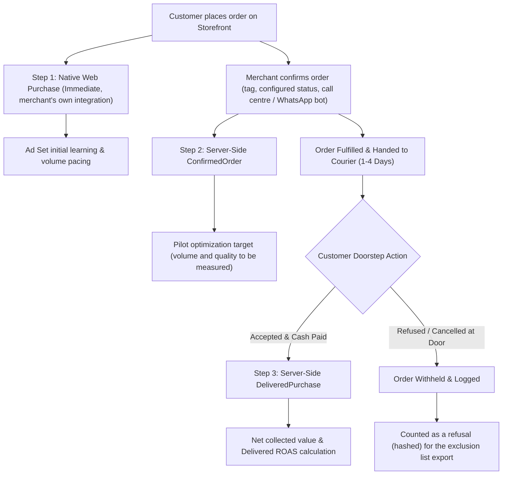

# MOTAHAI ARCHITECTURAL PLAYBOOK & OPERATIONAL RUNBOOK
**System:** Motahai Server-Side Conversion & Delivery Reconciliation Engine  
**Target Market:** MENA / GCC Cash on Delivery (COD) & E-Commerce  
**Platforms:** Shopify & Salla (courier status from Bosta and OTO)  
**Repository:** `https://github.com/Mo-ha33/Motahai`  
**Version:** 2.0, corrected against the code at commit 3a8e0b1 (Sprint S2 partly landed)  
**Date:** October 2026

---

## 1. Executive Summary & The Core Problem

Standard e-commerce tracking fires a Meta `Purchase` event immediately upon web checkout completion. In Cash on Delivery (COD) markets (Saudi Arabia, UAE, Egypt, Kuwait), a large share of placed orders are refused at the door, faked, or cancelled in transit. Industry ranges of 20% to 45% are often cited; Motahai has not measured this rate on its pilot stores yet.

### The Disaster Caused by Standard Tracking:
1. **Ad Algorithm Poisoning:** Meta's bidding algorithms optimize for people most likely to trigger a `Purchase` event. When checkout = `Purchase`, Meta finds users who press "Order Now" readily, including users with no intent to pay the courier.
2. **Inflated Reported ROAS:** Ads Manager can show a strong ROAS while refused and double-shipped orders tie up cash. The size of that gap is a pilot measurement, not a given.
3. **The Naive Fix Trap:** If you simply delay firing `Purchase` until courier delivery (3–7 days later), ad sets get less volume, may not reach Meta's roughly 50 events/week guideline, and stay in the Learning Phase. Meta's attribution window is 7 days, and it rejects events older than 7 days at upload.

---

## 2. The Solution: The 3-Step Signal Ladder (Rule D-005, "Coexist")

Motahai implements the **3-Step Signal Ladder**, decoupling **Campaign Velocity** from **Financial Ground Truth**. The merchant's native `Purchase` is left alone; Motahai only adds custom events.



Shipping also counts as confirmation when the merchant has no confirmation tag or status configured (`implicit_on_ship`, on by default). The Salla statuses `in_review` and `under_review` (and their Arabic names) do **not** count as confirmation: they mean the order is still awaiting review.

### The 3 Signal Levels:

| Signal Tier | Event Name | When Fired | `event_time` | Primary Purpose |
|---|---|---|---|---|
| **Tier 1: Volume** | Native `Purchase` | Checkout submit (merchant's own integration) | Instant (Browser) | Coexists natively. Motahai never sends it. |
| **Tier 2: Velocity & Quality** | `ConfirmedOrder` | Confirmation by tag, configured status, manual trigger, or shipment | Confirmation timestamp | Proposed optimization goal for the pilot. Its correlation with final delivery is a pilot hypothesis, not a measured figure. |
| **Tier 3: Financial Truth** | `DeliveredPurchase` | Cash collected at the door, after the settlement window (default 12 h) | **Original order placement timestamp** | Truth reporting, delivered-value ROAS, seed audiences. Value = net collected. |

---

## 3. Detailed Component Architecture

### A. Storefront Checkout Attribution Capture (`storefront/`)
- Runs in the client browser on the storefront. The snippets are `storefront/shopify/` (Shopify) and `storefront/salla/salla_capture.js` (Salla).
- Captures Meta click IDs (`_fbp`, `_fbc`, `fbclid`) and URL tracking parameters (`utm_source`, `utm_medium`, `utm_campaign`, `utm_content`, which may carry `{{ad.id}}`). The snippet file holds the exact list.
- Delivery to the order:
  - **Shopify:** the snippet writes the attribution to the cart attributes, so it reaches the order webhook.
  - **Salla:** the snippet posts to `POST /v1/capture/{merchant_id}` and also attaches the attribution to the order notes.
- Captures are quarantined in `pending_captures` (`capture.py`). A capture is merged into an order only when the signed order webhook has created that order, the tenant matches, and the order total matches within tolerance. Only empty order fields are filled.
- IP and user agent come from the connection and the `User-Agent` header, never from the request body.

### B. Inbound Webhook Ingestion & Cryptographic Verification (`webhook_routes.py`)
- **Shopify:** `X-Shopify-Hmac-Sha256` is checked over the raw body against the app-level secret in env `SHOPIFY_APP_SECRET`.
- **Salla:** `X-Salla-Signature` (HMAC-SHA256 over the raw body) is checked against env `SALLA_WEBHOOK_SECRET`.
- **Couriers (Bosta, OTO):** per-tenant secrets, see section 3E.
- **Fail-Closed Principle:** a missing secret, missing header, or mismatch returns HTTP 401 Unauthorized immediately. The attempt is recorded in `webhook_deliveries` with `signature_ok=False` (payload hash only, never the payload).
- **Idempotency:** each delivery is recorded in `webhook_deliveries`, and an identical redelivery that was already processed is not reprocessed (Shopify often resends `orders/updated`). Each conversion is claimed once in `capi_events`, which is unique on (tenant, order, event name), so a second attempt is refused as already emitted. Status changes are appended to `order_status_events`.

### C. Encrypted Checkout Context (D-006, `checkout_context.py`)
The checkout IP and user agent are kept until the conversion is sent, so the CAPI payload can still carry them when the courier reports delivery days later. The effect on Meta's match quality is a pilot measurement; no score is promised here.
- Stored **encrypted at rest** with Fernet (AES-128-CBC with HMAC-SHA256). Plaintext never reaches a database column or a log line.
- Decrypted only when the CAPI payload is built.
- Purged after a **successful live DeliveredPurchase**, or 14 days after capture, whichever comes first. A ConfirmedOrder does not purge.

### D. Meta Graph API CAPI Transmitter (v22.0, `META_GRAPH_API_VERSION`) (`capi_service.py`)
- **Advanced matching:**
  - Phone: normalized to digits in E.164 form (local Egyptian and Saudi numbers get their country code), then SHA-256 hashed.
  - Email, first name, last name, city, state, zip, country and external ID: trimmed, lower-cased and SHA-256 hashed.
  - Tokens: sent in the JSON request body as the `access_token` field, never in the URL query string or in logs.
- **7-Day Rule:**
  - Meta rejects the whole request if any event's `event_time` is more than 7 days old.
  - `event_time` for DeliveredPurchase is the **order placement time**, so the click-to-order window is measured from the click.
  - An order placed 6.5 days ago or more (`LATE_DELIVERY_CUTOFF`) is never sent. Its conversion becomes `late_delivery`, stays internal, and keeps its idempotency claim. This keeps every upload inside Meta's limit.
  - A DeliveredPurchase whose settlement time would fall past that cutoff is scheduled 1 hour before it.

### E. Courier Status Integrations (`webhook_routes.py`, `webhook_listener.py`)
- **Bosta (Egypt):** `POST /webhooks/bosta/{shop_domain}`. Delivered when state = 45. The `Authorization` header must match the tenant's secret (raw key or `Bearer`).
- **OTO (GCC aggregator):** `POST /webhooks/oto/{shop_domain}`. Delivered when the status is `delivered` (or its Arabic equivalent). The signature is HMAC-SHA256 over `orderId:status:timestamp`, checked against the tenant's secret.
- Each merchant configures its own URL with its own `shop_domain`. The tenant comes only from the URL, and orders are matched by (tenant, platform order id).
- The secret is the tenant's encrypted credential `bosta_webhook_secret` or `oto_webhook_secret`. **There is no global env secret.** A tenant without its secret gets 401. Set them with `scripts/onboard_store.py` (`--secrets-file` or `--generate-courier-secrets`).
- Torod and SMSA are not implemented.

---

## 4. Lifecycle State Machine & Event Matrix

```
[Order Placed] ──> [Confirmed: tag / status / bot / shipped] ──> [Shipped / In Transit] ──> [Delivered & Cash Paid]
       │                         │                                                                 │
       ▼                         ▼                                                                 ▼
Native Purchase          ConfirmedOrder CAPI                                  Settlement Window (default 12h)
 (Browser/Pixel)     (event_id=confirmed_<id>)                                                      │
                                                                                                    ▼
                                                                                          DeliveredPurchase CAPI
                                                                                          (event_id=delivered_<id>,
                                                                                           event_time = placed time)
```

### Complete Event Transition Table:

| Order Status | Payment Status | Courier Status | Action Taken | Meta Event Fired |
|---|---|---|---|---|
| `created` | `pending` (COD) | `unfulfilled` | Hashes stored; checkout IP/UA encrypted (D-006) | None (native integration fires browser `Purchase`) |
| `confirmed` | `pending` (COD) | `unfulfilled` | Confirmation by tag, configured status, or manual trigger | **`ConfirmedOrder`** (`value = order_total`, `event_time` = confirmation time) |
| `fulfilled` (shipped) | `pending` (COD) | `in_transit` | Shipped: implicit confirmation if none was seen earlier (`implicit_on_ship`) | **`ConfirmedOrder`** if not yet sent. DeliveredPurchase still held. |
| `fulfilled` | `paid` (COD) | `delivered` | Delivery recorded; settlement timer starts (`delivered_at`) | None yet (settlement window, default 12 h) |
| `fulfilled` | `paid` (COD) | `delivered` (+ settlement) | Due and before the 6.5-day cutoff | **`DeliveredPurchase`** (`value = net collected`, `event_time` = placed time) |
| `cancelled` | `voided` | `refused` / RTO | Refused at the door (dispatched, then cancelled) | **None.** Counted as a refusal in the hashed exclusion export. |
| `any` | `partially_refunded` | `delivered` | Customer kept some items | **`DeliveredPurchase`** (`value = order total minus successful refunds`). Shopify netting is implemented; Salla refund netting is not. |
| `any` | any | not yet delivered at placed + 6.5 days | Cutoff reached | **None.** Status `late_delivery`, never sent. |

---

## 5. Security & Zero-Trust Governance

1. **Cryptographic HITL Deployment Gate (D-003):**
   - Any live GTM publish action requires a signed operator token issued by `POST /approvals/gtm-publish`. Issuance requires the operator bearer key.
   - The token is bound to one container and one workspace, is single-use, and is valid for exactly 30 minutes.
   - Tokens are **Ed25519** signatures (`hitl_tokens.py`), with no HMAC fallback. The Core issuer holds only the private key (0600 PEM at `HITL_SIGNING_PRIVATE_KEY_PATH`). The Hermes/MCP verifier holds only the public key (`HITL_VERIFY_PUBLIC_KEY` or `HITL_VERIFY_PUBLIC_KEY_PATH`) and cannot mint a token.
   - Keypair: `python -m ameen_workforce.hitl_tokens generate-keypair --out <dir>`.
   - `HITL_SIGNING_KEY` is removed. Any old copy is treated as exposed and must be rotated.
   - Isolation: Core and the Hermes runtime are deployed separately. Manifests are in `deployment/isolation/` (README, docker-compose, systemd units).
   - Unauthenticated, synthetic or expired tokens are refused.
2. **Honest Auditing (No Synthetic Mocks):**
   - Health checks and audits run real network calls.
   - If a tag drops or a CDN fails, the system outputs an explicit error rather than a mock 200 OK.
3. **Unified GCP IAM Identity:**
   - The production service account is expected to be `tariq-gtm-agent@agentic-ai-494313.iam.gserviceaccount.com` (the address is named in `scripts/setup_github_board.py`).
   - The IAM binding itself cannot be checked from this repository. Confirm it in the GCP console.
4. **Onboarding secrets:** pass them with `--secrets-file` (mode 600 is enforced on POSIX) or `--secrets-stdin`. Secret values on the command line still work, but they are warned about because they stay in shell history.

---

## 6. Media Buyer Implementation Guide (Ads Manager Setup)

The steps below are the **pilot plan**. Thresholds and effects are hypotheses for the pilot stores to test, not results.

### 1. Custom Conversions Setup in Events Manager:
- **Conversion A: "Confirmed Order"**
  - Event Rule: `event_name` equals `ConfirmedOrder`.
  - Category: **Purchase**.
- **Conversion B: "Delivered Purchase"**
  - Event Rule: `event_name` equals `DeliveredPurchase`.
  - Parameter: use the event value (`custom_data.value`), which is the net collected amount.
  - Category: **Purchase**.

### 2. Campaign Bidding Strategy (pilot plan):
- **Phase 1 (Testing & Launch, low volume):**
  - Optimize ad sets for **`ConfirmedOrder`**, the proposed pilot goal.
  - Check whether the ad sets reach Meta's roughly 50 events/week guideline sooner than a delivered-purchase goal would allow. Confirmation timing depends on each merchant's process.
- **Phase 2 (Scaling, when volume allows):**
  - Duplicate winning ad sets and test **`DeliveredPurchase`** as the goal (value optimization). Whether it beats `ConfirmedOrder` is a question for the pilot.
  - Volume thresholds for this switch (for example 100+ orders/week) are placeholders to set after the pilot.

### 3. Ads Manager Custom Columns:
Configure a custom reporting preset with these formulas:
- **`Delivered ROAS`** = `DeliveredPurchase Conversion Value` ÷ `Amount Spent`
- **`Delivery Rate %`** = `Delivered Purchases` ÷ `Confirmed Orders` × 100
- **`Creative Doorstep Loss (estimate)`** = `(Confirmed Orders - Delivered Purchases) × Average Order Value`. This is an estimate of value at risk, not a cash figure.

### 4. Refuser Exclusion and Seed Audiences:
- Motahai builds two hashed lists per tenant with `audiences.export_tenant_audiences(session, tenant_id, out_dir)`. The operator runs it; **there is no scheduled Sunday export yet.**
  - `<tenant>_exclude_refusers.csv`: customers with at least 2 refusals in the last 180 days (phone and email SHA-256 hashes).
  - `<tenant>_seed_delivered_buyers.csv`: customers with a delivered order in the last 365 days (SHA-256 hashes, with order value).
- Lists under 100 rows get a warning, because Meta may not build an audience that small.
- Only SHA-256 hex digests are written. The CSV writer refuses anything else, so a raw identifier cannot reach a file.
- Upload the refuser list as a **Customer List Custom Audience** (for example `COD_Doorstep_Refusers_Exclude`) and add it to the **Exclusion** block of every active ad set.

---

## 7. Sunday Signal Hygiene Digest (S1-4, in progress)

The digest (`digest.py`) is being added by another agent and is **not yet in the committed tree or scheduled**. The planned weekly email (Sunday, 08:00 local time, tenant timezone) would summarize, per merchant:
- Orders placed
- Confirmed orders and confirmation rate
- Delivered and paid orders, with a delivery rate over matured cohorts
- Refused at the doorstep, kept out of the delivered signal
- Delivered ROAS next to the platform-reported ROAS
- Scheduler and tag health

Layout example only (illustrative figures, not measurements): "420 placed, 385 confirmed, 340 delivered."

---

## 8. Development & Implementation Roadmap

- [x] **Sprint 0:** Security hardening, GCP SA reconciliation, removal of synthetic mocks.
- [x] **Sprint 1 (S1-0 to S1-7):** Core CAPI engine, SQLite state store, Shopify/Salla webhook signatures, attribution capture. Test suite expanded to 216 passing tests at that point.
- [x] **S1-5 Scheduler:** `python -m ameen_workforce.scheduler` daemon (systemd unit, non-root) with `--check` health probe.
- [ ] **Sprint 2 (S2-1 to S2-7)**, status at 3a8e0b1 (`[x]` done, `[~]` partly, `[ ]` not started):
  - [x] `S2-1`: `event_time` = order placed time, 12 h default settlement window, 6.5-day `late_delivery` state.
  - [x] `S2-2`: ConfirmedOrder from merchant tag, merchant-configured status, implicit shipment/payment, or manual trigger. Salla review statuses excluded.
  - [x] `S2-3`: Fernet encryption of checkout IP/UA, purged after a live DeliveredPurchase or 14 days.
  - [~] `S2-4`: Shopify net collected value (refunds netted). Salla refund netting not implemented.
  - [~] `S2-5`: Bosta and OTO integrations. Torod and SMSA not implemented.
  - [~] `S2-6`: Refuser and seed list builder exists; runs manually, not on a schedule.
  - [ ] `S2-7`: Pilot ad account live validation.
  - In progress elsewhere: Ed25519 approval tokens (D-003) and the weekly digest (section 7).
