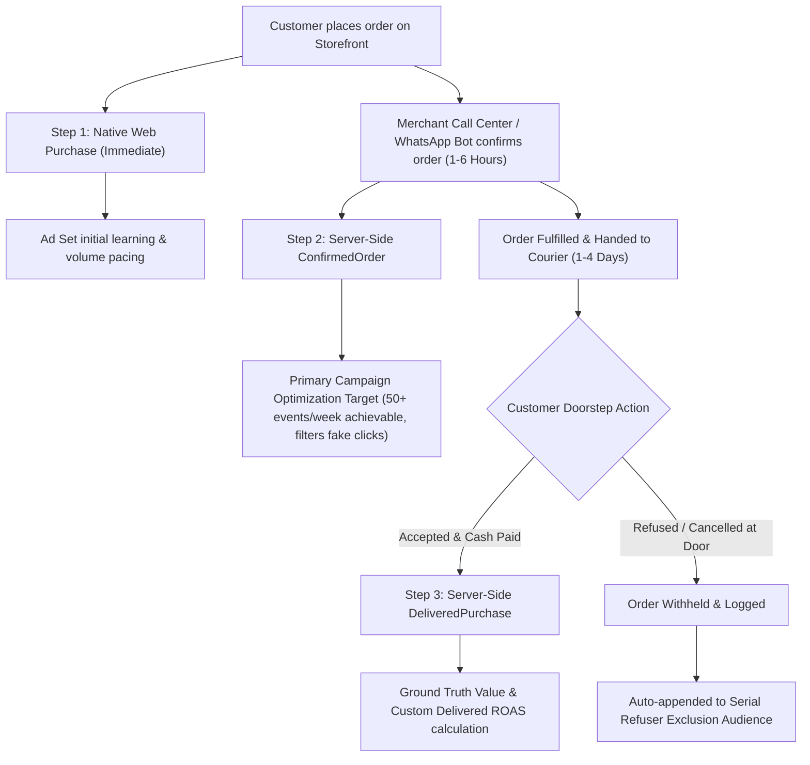

# MOTAHAI ARCHITECTURAL PLAYBOOK & OPERATIONAL RUNBOOK
**System:** Motahai Server-Side Conversion & Delivery Reconciliation Engine  
**Target Market:** MENA / GCC Cash on Delivery (COD) & E-Commerce  
**Platforms:** Shopify & Salla  
**Repository:** `https://github.com/Mo-ha33/Motahai`  
**Version:** 2.0 (Post-Sprint S1 & S2 Roadmap)  
**Date:** October 2026

---

## 1. Executive Summary & The Core Problem

Standard e-commerce tracking fires a Meta `Purchase` event immediately upon web checkout completion. In Cash on Delivery (COD) markets (Saudi Arabia, UAE, Egypt, Kuwait), **20% to 45% of placed orders are refused at the door, fake, or cancelled in transit**.

### The Disaster Caused by Standard Tracking:
1. **Ad Algorithm Poisoning:** Meta's bidding algorithms optimize for people most likely to trigger a `Purchase` event. When checkout = `Purchase`, Meta aggressively finds users who love pressing "Order Now" with zero intent to pay the courier.
2. **Artificial ROAS:** Merchants see a 4.0x ROAS in Ads Manager, while their bank account is bleeding cash due to double shipping fees and refused inventory.
3. **The Naive Fix Trap:** If you simply delay firing `Purchase` until courier delivery (3–7 days later), ad sets starve for volume, cannot achieve the **50 events/week** threshold, get trapped in the **Learning Phase**, and fail Meta's **7-day attribution / 7-day CAPI staleness window**.

---

## 2. The Solution: The 3-Step Signal Ladder (Rule D-005 Evolution)

Motahai implements the **3-Step Signal Ladder**, decoupling **Campaign Velocity** from **Financial Ground Truth**:



### The 3 Signal Levels:

| Signal Tier | Event Name | When Fired | `event_time` | Primary Purpose |
|---|---|---|---|---|
| **Tier 1: Volume** | Native `Purchase` | Checkout Submit | Instant (Browser) | Coexists natively. Keeps campaign spending smooth. |
| **Tier 2: Velocity & Quality** | `ConfirmedOrder` | Phone/WhatsApp confirmation (1–6 hrs) | Confirmation Timestamp | **The Recommended Ad Set Optimization Goal.** 80%+ correlation to final delivery. |
| **Tier 3: Financial Truth** | `DeliveredPurchase` | Cash collected at door + N-hour settlement | **Original Order Placement Timestamp** | Truth reporting, Custom Delivered ROAS, LTV lookalikes. |

---

## 3. Detailed Component Architecture

### A. Storefront Checkout Attribution Capture (`storefront/attribution.js`)
- Runs in the client browser during checkout.
- Captures:
  - Meta Click IDs: `_fbp`, `_fbc` (formatted as `fb.1.{timestamp}.{fbclid}`).
  - URL Tracking Macros: `utm_source`, `utm_medium`, `utm_campaign`, `utm_content` (containing `{{ad.id}}`), `utm_term`.
  - Network metadata: IP and User-Agent.
- Passes parameters directly into the order cart attributes / note attributes on Shopify and Salla.

### B. Inbound Webhook Ingestion & Cryptographic Verification (`webhook_routes.py`)
- **Shopify:** Validates incoming payload using `X-Shopify-Hmac-Sha256` header against the merchant's webhook secret.
- **Salla:** Validates Salla signature and Bearer security headers.
- **Fail-Closed Principle:** Any payload failing cryptographic signature validation returns HTTP 401 Unauthorized immediately.
- **Idempotency Engine:** Webhooks from Shopify frequently resend (`orders/updated`). Every payload checks `order_events` table by `(tenant_id, order_id, event_type)` before queuing.

### C. Fernet-Encrypted Customer Identity Vault (`db.py`)
To prevent dropping Event Match Quality (EMQ) when couriers report deliveries days later:
- Checkout IP and User-Agent are stored **encrypted at rest** using AES-128-CBC / HMAC-SHA256 (Fernet).
- Decrypted solely when assembling the Meta CAPI payload.
- Automatically purged from disk upon successful CAPI 200 OK delivery, or auto-expired after 14 days.

### D. Meta Graph API v20.0 CAPI Transmitter (`capi_service.py`)
- **Advanced Matching Normalization:**
  - Phone: Converted to E.164 standard (e.g., `+96650...`, `+2010...`) and hashed with SHA-256.
  - Email, First Name, Last Name, City, Country, Zip: Lowercased, whitespace trimmed, and SHA-256 hashed.
  - Tokens: Transmitted exclusively in the POST request body—never in query params or stdout logs.
- **CAPI 7-Day Limit Safeguard:**
  - Meta rejects the entire payload if any event has `event_time` > 7 days old.
  - Events hitting 6.5 days without courier resolution transition to `late_delivery` state (reported internally, omitted from CAPI to prevent API bans).

---

## 4. Lifecycle State Machine & Event Matrix

```
[Order Placed] ──> [Confirmed via Call/Bot] ──> [Shipped / In Transit] ──> [Delivered & Cash Paid]
       │                         │                                                  │
       ▼                         ▼                                                  ▼
Native Purchase          ConfirmedOrder CAPI                             Settlement Window (12h)
 (Browser/Pixel)     (event_id=confirmed_<id>)                                      │
                                                                                    ▼
                                                                          DeliveredPurchase CAPI
                                                                          (event_id=delivered_<id>)
```

### Complete Event Transition Table:

| Order Status | Payment Status | Courier Status | Action Taken | Meta Event Fired |
|---|---|---|---|---|
| `created` | `pending` (COD) | `unfulfilled` | Store identifiers & attribution encrypted | None (Native Pixel fires browser `Purchase`) |
| `confirmed` | `pending` (COD) | `unfulfilled` | Confirmation detected via tag/status | **`ConfirmedOrder`** (`value = order_total`) |
| `open` | `pending` (COD) | `in_transit` | Order shipped with courier | None (Conversion held) |
| `fulfilled` | `paid` (COD) | `delivered` | Courier collects cash | Enter 12h settlement window |
| `fulfilled` | `paid` (COD) | `delivered` (+12h) | Post-settlement check | **`DeliveredPurchase`** (`value = net_collected`) |
| `cancelled` | `voided` | `refused` / `RTO` | Customer refused at door | **None.** Append phone to Refuser Exclusion List. |
| `any` | `partially_refunded` | `delivered` | Customer kept 1 of 3 items | **`DeliveredPurchase`** (`value = current_total_price`) |

---

## 5. Security & Zero-Trust Governance

1. **Cryptographic HITL Deployment Gate (D-003):**
   - Any live GTM publish action requires a signed operator token generated via `POST /approvals/gtm-publish`.
   - Token is single-use, workspace-scoped, and valid for exactly 30 minutes.
   - Unauthenticated or synthetic calls are refused immediately.
2. **Honest Auditing (No Synthetic Mocks):**
   - Health checks and audits run real network handshakes.
   - If a tag drops or a CDN fails, the system outputs explicit error codes rather than mock 200 OKs.
3. **Unified GCP IAM Identity:**
   - Production service account strictly bound to: `tariq-gtm-agent@agentic-ai-494313.iam.gserviceaccount.com`.

---

## 6. Media Buyer Implementation Guide (Ads Manager Setup)

To maximize profitability using Motahai, media buyers follow this playbook:

### 1. Custom Conversions Setup in Events Manager:
- **Conversion A: "Confirmed Order"**
  - Event Rule: `event_name` equals `ConfirmedOrder`.
  - Category: **Purchase**.
- **Conversion B: "Delivered Purchase"**
  - Event Rule: `event_name` equals `DeliveredPurchase`.
  - Parameter: Use event value (`custom_data.value`).
  - Category: **Purchase**.

### 2. Campaign Bidding Strategy:
- **Phase 1 (Testing & Launch - 0 to 50 Orders/week):**
  - Optimize ad sets for **`ConfirmedOrder`**.
  - Since orders are confirmed within hours, ad sets get 50+ signals rapidly and exit the Learning Phase cleanly.
- **Phase 2 (Scaling & High Volume - 100+ Orders/week):**
  - Duplicate winning ad sets and switch optimization goal to **`DeliveredPurchase`** (Value Optimization / Target ROAS).
  - The algorithm now bids specifically on high-integrity buyers who pay at the doorstep.

### 3. Ads Manager Custom Columns:
Configure a custom reporting preset with these formulas:
- **`Delivered ROAS`** = `DeliveredPurchase Conversion Value` ÷ `Amount Spent`
- **`Delivery Rate %`** = `Delivered Purchases` ÷ `Confirmed Orders` × 100
- **`Creative Doorstep Loss`** = `(Confirmed Orders - Delivered Purchases) × Average Order Value`

### 4. Serial Refuser Audiences:
- Every Sunday, Motahai exports the encrypted SHA-256 hashed list of customers who refused orders at the door.
- Upload this list as a **Customer List Custom Audience** named `COD_Doorstep_Refusers_Exclude`.
- Add this audience to the **Exclusion** block of every active ad set.

---

## 7. Weekly Sunday Signal Hygiene Email Digest

Every Sunday at 08:00 AM local time, merchants receive a clean HTML executive email summarizing:
- **Real Orders Placed:** (e.g., 420 orders)
- **Confirmed Orders:** (e.g., 385 orders / 91.6%)
- **Delivered & Paid Cash:** (e.g., 340 orders / 88.3% Delivery Rate)
- **Refused at Doorstep:** (e.g., 45 orders saved from ad algorithm feedback)
- **True Delivered ROAS:** (e.g., 3.42x vs Vanity Reported 4.21x)
- **Drift Sentinel Status:** 100% GTM Tag Uptime, No broken dataLayers.

---

## 8. Development & Implementation Roadmap

- [x] **Sprint 0:** Security hardening, GCP SA reconciliation, removal of synthetic mocks.
- [x] **Sprint 1 (S1-0 to S1-7):** Core CAPI engine, SQLite state store, Shopify/Salla webhook signatures, attribution capture, test suite expanded to 216 passing tests.
- [ ] **Sprint 2 (S2-1 to S2-7):**
  - `S2-1`: Implement `event_time = order_placed_at`, 12h settlement window, and 6.5-day `late_delivery` state.
  - `S2-2`: Implement `ConfirmedOrder` event trigger (Shopify tag, Salla status, WhatsApp confirmation).
  - `S2-3`: Fernet encryption for checkout IP/UA with auto-purge after dispatch.
  - `S2-4`: Fix `partially_refunded` to send net collected value.
  - `S2-5`: Courier integrations (OTO, Torod, Bosta, SMSA).
  - `S2-6`: Weekly Doorstep Refusers exclusion audience generator.
  - `S2-7`: Pilot ad account live validation.
