# AI Creative Video Director: Architecture & Commercial Review

> Scope: the proposed Wesam.ai × Hermes (MCP) product that turns the manually validated
> 18-block / 10-second corporate-film method into an autonomous AI employee.
> This review is grounded in what already runs in this repository (`ops/hermes/`), because
> the video product will inherit its transport, gateway and VPS constraints.
>
> Facts about third-party engines and the MCP spec are as of the time of writing. Items marked
> **(verify)** change often; check them before building.

---

## 0. Verdict: the ten findings that matter most

| # | Finding | Severity | Section |
|---|---|---|---|
| 1 | **Don't let the Wesam LLM orchestrate the pipeline.** Five fine-grained tools chained by a chat agent means four places where numbers get re-typed by an LLM. Expose one coarse `produce_package` job. Hermes runs the fixed order in code. | Critical | A.0 |
| 2 | **Pass references, not values.** `build_production_manifest` must accept only IDs of server-stored, hash-chained stage outputs, never timings or prompts copied through the agent. This is the actual "zero hallucination" guarantee. | Critical | A.1 |
| 3 | **A word count only approximates speech time.** 18–20 words ≈ 8 s holds for English at 135–150 wpm, but not for Arabic, numerals ("1998" is 4–5 spoken words) or acronyms, and it varies by up to ±20% across TTS voices. Calibrate on normalised syllables per voice profile. Where a TTS engine is in the loop, measure the real audio. | High | 1, A.3 |
| 4 | **Writing HEX codes into a prompt doesn't make the output match the brand.** Generative video models don't render `#D42429` faithfully, and they garble logos and on-screen text. Composite logos and text afterwards as overlays (the safe zone is then guaranteed by how it's built), and verify the colours of the rendered frames (ΔE2000), not the prompt text. | High | A.3 |
| 5 | **115 BPM doesn't fit 10-second blocks.** 10 s = 19.17 beats, so every cut drifts off the beat. Use a tempo where BPM is a multiple of 24 (96 / **120** / 144); 10 s is then an integer number of 4/4 bars. 120 BPM also gives exact bars for 8-second blocks. | Medium | 1 |
| 6 | **The 10-second block length should be a setting of each video engine, not a fixed constant.** Native clip lengths differ by engine (e.g. Veo 4/6/8 s, Runway/Kling 5/10 s) **(verify)**. A 10 s block that the engine can't produce in one clip needs two clips and a cut. | Medium | 1 |
| 7 | **Cut `browser_automation_vids` from v1.** It needs each customer's Google session on your VPS (credential liability), probably breaches Google's terms on automated access, breaks whenever the UI changes, and your gateway already allows only 2 browsers across a shared 8 GB box. | High | A.5 |
| 8 | **Multi-tenancy doesn't exist yet.** Today one capability URL is one principal, and `caller_agent`/`client` are unverified. Selling on a marketplace needs the tenant derived from the credential (one capability URL or OAuth client per buyer), never from a tool argument. | Critical | A.4 |
| 9 | **A script, prompts, JSON and SRT don't add up to a video.** On their own they won't reliably sell for $2,000. Sell a *Production Bible* plus an **animatic** (keyframes + scratch voiceover + subtitles, rendered with ffmpeg) and price it against agency *pre-production*, not finished production. | High | B.2 |
| 10 | **Run the video tools on their own MCP server.** Wesam shares one connector per workspace, so adding video tools to the GTM Hermes catalogue would put them in front of all 8 GTM agents (and vice versa). The GTM Hermes also shares a 4 vCPU / 8 GB VPS with production (`MemoryMax=3G`). | High | A.0, A.4 |

---

## 1. Corrections to the validated method

The method is sound: fixed blocks, a speech budget with a tail buffer, and centralised brand rules.
These are the calibration details that will break when you automate it.

### 1.1 Speech budget

- 18–20 words in 8 s = **135–150 wpm**, a normal English narration pace. Keep that as the
  English default, but don't treat word count as the measure of time.
- **Normalise the text before counting.** Expand numerals, dates, currencies, percentages and
  acronyms the way the TTS engine will speak them: "Since 1998, ROI grew 35%" has 6 tokens but
  ~14 spoken words and ~22 syllables. Count after normalisation.
- **Budget in syllables per voice profile**, not words. Keep a rate table
  `voice_profile_id → syllables_per_second (p50, p90)`, learned by synthesising a fixed
  calibration corpus through each voice. Budget against **p90** so most blocks fit first time.
- **Arabic and other languages need their own profiles.** Arabic words carry clitics (و، ال، ب)
  and are longer on average, so the 18–20-word rule doesn't carry over. When the target voice is
  synthesised in the pipeline, **measure the real audio duration** (`ffprobe`). A measured
  duration is the only timing figure you can fully trust.

### 1.2 Buffer and cadence

- 18 × 2 s buffers = 36 s of the 180 s film without voiceover. That's fine **if** the music bed and
  visuals carry it. If not, the film feels choppy. Make the buffer a range (e.g. 1.2–2.0 s,
  default 2.0) with a hard floor that protects against clipping. Don't make it a fixed gap.
- Never let a subtitle cue or a voiceover phrase cross a block boundary. A block boundary is a cut.

### 1.3 Music grid

| BPM | Beat (s) | Beats per 10 s block | 4/4 bars per 10 s block |
|---|---|---|---|
| 115 (current) | 0.5217 | 19.17 | 4.79: cuts drift |
| 96 | 0.625 | 16 | **4** |
| **120** | 0.5 | 20 | **5** (and 4 bars per 8 s block) |
| 144 | 0.4167 | 24 | **6** |

For integer bars in a block of `B` seconds: `BPM = 240·n / B`. The calibrator should choose the
tempo closest to the creative intent (e.g. "~115, energetic") that satisfies this, and write it
into the manifest. Music generators don't hit exact BPM either, so beat-track the delivered track
(e.g. librosa) and time-stretch it, or flag it.

### 1.4 Engine-native clip lengths

Put block geometry in an **engine profile** (`veo-*`, `runway-gen*`, `kling-*`, `google-vids`) with
`native_clip_ms[]`, `max_prompt_chars`, `supports_reference_images`, `supports_seed`,
`aspect_ratios[]`, and a policy blocklist. If the 10 s block isn't a native length, the profile
says how to split it (e.g. 6 s + 4 s with a cut on a bar line).

---

## A. Technical & MCP architecture

### A.0 Topology: where the intelligence should live

```mermaid
flowchart LR
    subgraph W["Wesam.ai: AI Creative Video Director (per buyer workspace)"]
        A[Director persona<br/>brief intake · client chat]
    end
    subgraph V["Video MCP node (separate from GTM Hermes)"]
        G["Gateway<br/>credential → tenant · policy_guard · budgets"]
        T["MCP tools (thin)"]
        Q[("Job store<br/>Postgres")]
        WK["Pipeline worker<br/>fixed state machine"]
        D["Deterministic core (no LLM)<br/>normalise · calibrate · brand lint<br/>prompt assembly · SRT · manifest"]
        L["LLM stage (bounded)<br/>script beats · prompt slot text · repairs"]
        S[("Object storage<br/>per-tenant prefix, signed URLs")]
        G --> T --> Q --> WK
        WK --> D
        WK --> L
        WK --> S
    end
    A == "MCP (capability URL per buyer)" ==> G
    T -. "job status · signed link" .-> A
```



Principles, carried over from `ops/hermes/home/skills/README.md` ("deterministic code does the
counting and parsing; the LLM does judgement on the structured result"):

1. **The LLM never produces a number that ships.** Timecodes, durations, word/syllable counts,
   BPM, cue times, safe-zone boxes and colour values are all computed by code. The LLM writes only
   prose: voiceover lines and the text inside prompt slots.
2. **The pipeline order is fixed, so it belongs in code.** The order is brief → script → **calibrate**
   → prompt slots → **assemble prompts** → **brand lint** → repair loop → **package**. Note that
   brand enforcement is a *gate on outputs*. In the tool list you proposed it runs before prompt
   generation, so it can only check the brief.
3. **The Wesam agent is the client-facing layer, not the orchestrator.** It gathers the brief,
   starts the job, relays clarifying questions, and presents results.
4. **"Deterministic" means reproducible from stored state, not regenerable.** LLM stages are
   pinned (model version, temperature 0, prompt template version) and their outputs are
   **frozen** once validated. A re-run reads the frozen output. It doesn't call the model again.
5. **Run it on a separate MCP server and node.** Wesam shares one connector per workspace. The
   GTM Hermes already exposes 18 tools to every GTM agent, and tool-selection accuracy drops as the
   catalogue grows. That VPS is also shared with production, with Hermes capped at 3 GB. Reuse the
   *code* (`policy_guard.py`, the Nginx capability-URL pattern, the deploy script), not the instance.

#### Revised tool catalogue (what Wesam sees)

| Tool | Kind | Purpose |
|---|---|---|
| `video_brand_kit_upsert` | sync | Store/version a tenant's brand rules (palette, fonts, logo assets, safe zones, character refs, dress code). Returns `brand_kit_id@version`. |
| `video_produce_package` | **async** | Start the full pipeline from a validated brief. Returns `job_id`. |
| `video_job_wait` | sync, long-poll | Block up to `max_wait_s` (≤ 45) for progress or completion; returns compact status. |
| `video_job_answer` | sync | Answer a `NEEDS_INPUT` question (e.g. "Block 7 is 3 words over; approve this rewrite?"). |
| `video_revise_block` | async | Change one block (script, visual direction) and re-run only the affected stages. Neighbouring blocks keep their timecodes. |
| `video_job_cancel` | sync | Cancel and release budget. |
| `video_calibrate_preview` | sync | Dry-run calibration of a draft script during intake, so the agent can say "your script is 22 s too long" before starting a job. |

`calibrate_video_blocks`, `enforce_brand_rules`, `generate_omni_prompts` and
`build_production_manifest` stay **internal pipeline stages**. You can also expose them on an
operator-only role for debugging, like `human_operator` in `tool-policy.yaml`.

### A.1 Tool contracts that rule out invented numbers

Contract rules (enforced server-side with strict JSON Schema validation. Never rely on the client
validating):

- **Integer milliseconds everywhere.** No float seconds, no `"00:01:10"` strings in machine fields.
  SRT timecodes are *rendered* from ms at the end.
- **The server computes every derived field.** `start_ms`/`end_ms` are never inputs. If a caller sends
  them, `additionalProperties: false` rejects the call.
- **IDs, not payloads, between stages.** Each stage output is stored with
  `id`, `input_sha256`, `output_sha256`, `stage_version`. The next stage takes the ID and
  **verifies the lineage chain** (prompts were generated from *this* calibration of *this* script
  version). A stale or mismatched chain is rejected.
- **Closed vocabularies.** `language`, `voice_profile_id`, `engine_profile_id`, `aspect_ratio`,
  `status` are enums resolved server-side. Unknown values are rejected, never guessed.
- **Report every violation at once.** Return all schema/limit violations in one error so the agent
  can fix them in a single round.
- **Use MCP's structured output.** Declare `outputSchema` and return `structuredContent` (MCP
  2025-06-18+), plus a short text summary for clients that ignore structured output. Use
  `isError: true` for tool-level failures and JSON-RPC errors only for protocol faults. Add tool
  annotations (`readOnlyHint`, `idempotentHint`, `destructiveHint`) **(verify which Wesam honours)**.
- **Idempotency.** Every mutating call carries `idempotency_key`, unique per `(tenant, key)`. A
  retried call returns the original job, so an agent retry never bills twice.

#### `calibrate_video_blocks` (internal stage; same core powers `video_calibrate_preview`)

Input:

```json
{
  "$id": "wesam.video.calibrate.request.v1",
  "type": "object",
  "additionalProperties": false,
  "required": ["project_id", "script_version", "language", "voice_profile_id", "engine_profile_id", "blocks"],
  "properties": {
    "project_id":        {"type": "string", "pattern": "^prj_[a-z0-9]{16}$"},
    "script_version":    {"type": "integer", "minimum": 1},
    "language":          {"enum": ["en-US", "en-GB", "ar-EG", "ar-SA", "ar-AE"]},
    "voice_profile_id":  {"type": "string", "pattern": "^vp_[a-z0-9_]+$"},
    "engine_profile_id": {"type": "string", "pattern": "^ep_[a-z0-9_]+$"},
    "timing_profile_id": {"type": "string", "default": "tp_block10_buf2"},
    "measure":           {"enum": ["estimate", "tts"], "default": "estimate"},
    "blocks": {
      "type": "array", "minItems": 1, "maxItems": 60,
      "items": {
        "type": "object", "additionalProperties": false,
        "required": ["block_index", "voiceover_text"],
        "properties": {
          "block_index":    {"type": "integer", "minimum": 1, "maximum": 60},
          "beat":           {"type": "string", "maxLength": 280},
          "voiceover_text": {"type": "string", "minLength": 1, "maxLength": 400}
        }
      }
    }
  }
}
```

Output (`structuredContent`):

```json
{
  "calibration_id": "cal_7f3a…",
  "status": "PASS | PASS_WITH_WARNINGS | FAIL",
  "calibrator_version": "1.4.0",
  "rate_table_version": "vp_en_us_neural_d@2026-09",
  "input_sha256": "…",
  "timing": {"block_ms": 10000, "speech_budget_ms": 8000, "tail_buffer_ms": 2000, "bpm": 120, "bars_per_block": 5},
  "totals": {"blocks": 18, "duration_ms": 180000, "speech_ms_p90": 139200},
  "blocks": [
    {
      "block_index": 7,
      "start_ms": 60000, "end_ms": 70000,
      "normalized_text": "since nineteen ninety-eight …",
      "word_count": 21, "syllable_count": 34,
      "speech_ms_p50": 7900, "speech_ms_p90": 8650,
      "measured_ms": null,
      "budget_ms": 8000, "headroom_ms": -650,
      "status": "OVER",
      "fix": {"max_syllables": 31, "max_words_hint": 19, "strategy": "rewrite_shorter"}
    }
  ]
}
```

`fix` gives the repair loop an exact numeric target, so the LLM is told "≤ 31 syllables", not
"make it shorter".

#### `build_production_manifest` (internal stage, final packaging)

```json
{
  "$id": "wesam.video.manifest.request.v1",
  "type": "object",
  "additionalProperties": false,
  "required": ["project_id", "calibration_id", "prompts_id", "brand_check_id", "outputs", "idempotency_key"],
  "properties": {
    "project_id":      {"type": "string", "pattern": "^prj_[a-z0-9]{16}$"},
    "calibration_id":  {"type": "string", "pattern": "^cal_[a-z0-9]{16}$"},
    "prompts_id":      {"type": "string", "pattern": "^prm_[a-z0-9]{16}$"},
    "brand_check_id":  {"type": "string", "pattern": "^brc_[a-z0-9]{16}$"},
    "outputs": {
      "type": "array", "uniqueItems": true, "minItems": 1,
      "items": {"enum": ["block_json", "srt", "vtt", "master_md", "production_bible_pdf", "zip"]}
    },
    "subtitle_profile_id": {"type": "string", "default": "sp_broadcast_en"},
    "idempotency_key":     {"type": "string", "minLength": 16, "maxLength": 64}
  }
}
```

It contains no timings and no prompt text. The builder loads the frozen stage outputs and refuses
to run unless all of the following hold:

- `calibration.status != FAIL` and `brand_check.status == PASS`;
- `prompts.lineage.calibration_id == calibration_id` (no stale prompts);
- Σ block durations == `totals.duration_ms`, blocks are contiguous with no gaps or overlaps, and
  every block falls within the engine profile's clip lengths;
- every prompt is ≤ the engine's `max_prompt_chars`;
- every SRT cue sits inside its block's speech window and is within the subtitle profile
  (e.g. ≤ 42 chars/line, ≤ 2 lines, 1–7 s per cue, ≤ 17 CPS; RTL markers for Arabic).

Output: `{manifest_id, manifest_sha256, files: [{name, sha256, bytes}], download_url (signed, expiring), summary}`.

#### `Block_XX.json` (artifact schema, abridged)

```json
{
  "schema": "wesam.video.block.v1",
  "project_id": "prj_…", "block_index": 7,
  "timecode": {"start_ms": 60000, "end_ms": 70000, "speech_window_ms": [0, 8000], "tail_buffer_ms": 2000},
  "voiceover": {"text": "…", "normalized_text": "…", "syllables": 31, "speech_ms_p90": 7890,
                "voice_profile_id": "vp_en_us_neural_d", "ssml": "<speak>…</speak>"},
  "visual": {"engine_profile_id": "ep_veo_x", "aspect_ratio": "16:9", "clips_ms": [6000, 4000],
             "slots": {"subject": "…", "action": "…", "setting": "…", "camera": "…", "lighting": "…", "style": "@style_omni_v3"},
             "prompt": "…", "negative_prompt": "…", "prompt_chars": 612,
             "reference_asset_ids": ["chr_founder_1998_front", "chr_founder_1998_3q"], "seed": null},
  "overlays": [{"asset_id": "logo_primary", "anchor": "top_left", "box_pct": [0.04, 0.04, 0.14, 0.10]},
               {"type": "lower_third", "text": "…", "font": "brand_sans_bold", "color": "primary"}],
  "audio": {"music_cue_id": "cue_build_a", "bpm": 120, "bar_range": [26, 30], "section": "build"},
  "subtitles": [{"start_ms": 60200, "end_ms": 63900, "text": "…", "cps": 15.1}],
  "brand": {"brand_kit": "bk_acme@12", "check_id": "brc_…", "findings": []},
  "lineage": {"script_version": 3, "calibration_id": "cal_…", "prompts_id": "prm_…", "input_sha256": "…"}
}
```

**Prompts are built from slots, not free text.** The LLM fills each slot within a per-slot
character cap. Code assembles the final prompt from the engine template, injects the frozen
style token block (`@style_omni_v3`) and the brand colour phrasing, and trims slots in priority
order if the engine's `max_prompt_chars` is exceeded. Because the style block is reused verbatim
across all 18 prompts, the style markers stay consistent by construction.

### A.2 Long-running work: jobs, long-polling, and when to stream

**Recommendation: use a job ID plus a long-poll tool as the contract, with progress notifications
as an optional extra.**

Why not one long streaming call:

- The existing edge cuts at `proxy_read_timeout 330s`. Wesam's own per-tool-call timeout and
  per-turn timeout are unknown **(verify)** and almost certainly shorter.
- SSE connections drop. The repo already notes idle proxies cutting long calls, and the current
  connector uses the legacy HTTP+SSE transport, which was superseded by Streamable HTTP in MCP
  2025-03-26. A dropped stream loses the result unless it was a job anyway.
- An LLM agent can't "wait" between turns. It either polls inside its turn (each poll costs tokens)
  or the user comes back later. A long-poll tool reduces a typical package to 2–4 tool calls.

Pattern:

```text
video_produce_package(brief, brand_kit_id, idempotency_key)  → {job_id, state: "QUEUED", eta_ms, poll: "video_job_wait"}
video_job_wait(job_id, since_seq, max_wait_s ≤ 45)            → returns on state change or timeout
      {job_id, seq, state, stage, progress: {blocks_done: 12, blocks_total: 18},
       question?: {id, text, options[]},          // when state = NEEDS_INPUT
       result?: {manifest_id, download_url, summary}}   // when state = DONE
```

- **Status responses stay under ~300 tokens.** Never return artifacts inline. Return a signed,
  expiring URL to a per-tenant object-storage prefix (not the VPS disk). Return resource links
  where the client supports them.
- **Job state machine:**
  `QUEUED → SCRIPTING → CALIBRATING → PROMPTING → BRAND_CHECK ⇄ REPAIRING (≤ 2 rounds per block) → PACKAGING → DONE`,
  plus `NEEDS_INPUT`, `FAILED`, `CANCELLED`. Per-block sub-states make a failure in block 13
  resumable without redoing blocks 1–12.
- **Keep the fast path fast.** Calibration, linting, SRT and manifest building are pure CPU and take
  milliseconds. The slow part is LLM calls. Run per-block prompt generation in parallel (bounded
  by the tenant's concurrency) and the text-only package should finish in well under a minute.
  That way most users see it complete within the first or second `video_job_wait`.
- **Add-ons when the client supports them:** emit `notifications/progress` against the caller's
  `progressToken`, and adopt the MCP **Tasks** primitive (experimental in the 2025-11-25 spec
  revision) once Wesam's client supports it **(verify)**. Keep the job tools either way. They're the
  only contract every client can use.
- **Infrastructure:** Postgres job table (`unique(tenant_id, idempotency_key)`), a worker queue
  (Arq/Celery/RQ or a Postgres-backed queue), Redis for the guard's buckets and budgets.
  `policy_guard.py` keeps its state in memory and is single-worker, as its own docstring warns.

### A.3 Failure modes and automatic repair

Repair policy: there are three classes, and every repair is logged in the block's `brand.findings` /
job audit.

1. **Deterministic fix**: code corrects it silently (re-time a cue, normalise a colour phrase).
2. **Bounded LLM repair**: re-prompt with the exact numeric target and the specific violation,
   **max 2 rounds per block**, re-validate after each round.
3. **Escalate**: `NEEDS_INPUT` with one precise question. Never truncate meaning silently.

These map onto the Verdict Envelope statuses Hermes already uses (`ops/hermes/home/SOUL.md` §7):
deterministic fix → `APPROVED_WITH_CONDITIONS`, repair exhausted → `BLOCKED`, missing asset →
`NEEDS_EVIDENCE`.

| # | Failure mode | Likelihood | Detection (deterministic) | Repair |
|---|---|---|---|---|
| 1 | Voiceover over budget (LLM writes 23 words) | Very high | Syllable/p90 estimate vs budget; measured duration when TTS runs | Class 2 with `fix.max_syllables`; then Class 3 offering split/merge with a neighbour block |
| 2 | Numerals/acronyms/brand names under-counted | High | Normalisation pass before counting; tenant pronunciation lexicon | Class 1 (normalise); add the lexicon entry to the brand kit |
| 3 | TTS speed differs by engine/voice/language | High | Per-voice rate table; `ffprobe` on synthesised audio | SSML `prosody rate` within ±8% (beyond that sounds unnatural), else Class 2 |
| 4 | Agent changes values while copying them between calls | High (if fine-grained tools are exposed) | Lineage hashes; ID-only stage inputs | Impossible by construction: values never round-trip through the LLM |
| 5 | Wrong/missing brand colour phrasing in prompts | Medium | Lint: every colour reference resolves to a brand-kit token; no stray HEX | Class 1: code injects "deep crimson red (#D42429)" from the token |
| 6 | Rendered frames off-palette | Very high | Sample frames → dominant colours in CIELAB → ΔE2000 vs palette | Colour-grade LUT in post (Class 1), else re-generate with a reference frame |
| 7 | Logo/text rendered by the model (garbled) | Very high | Prompt lint forbids text/logo requests; OCR on frames | Never generate them: overlays composited in post, safe zone guaranteed by the box |
| 8 | Character drift across 18 blocks | Very high | Face-embedding cosine similarity vs reference anchors per block | Engine reference images / seed where supported; re-generate below threshold; Class 3 after 2 tries |
| 9 | Prompt over engine length limit | Medium | `prompt_chars` vs engine profile | Class 1: drop/shorten slots by priority |
| 10 | Engine content-policy rejection (real person likeness, trademarked style names such as "Pixar") | Medium | Per-engine blocklist lint before submission | Class 1 substitution ("stylised 3D animation, soft global illumination, subsurface scattering") |
| 11 | Prompt injection in the brief or uploaded brand PDF ("ignore the rules…") | Medium | Brief and brand docs are data; brand kit fields are typed and validated | Never interpolate raw brief text into system instructions; quote it as data |
| 12 | Duplicate job from agent retry | High | `idempotency_key` | Return the existing job |
| 13 | Partial pipeline failure (provider timeout on block 13) | High | Per-block state | Retry that block with provider failover (reuse `llm-router/`), resume |
| 14 | SRT defects (CPS too high, overlap, RTL punctuation) | Medium | Subtitle profile checks | Class 1 re-segmentation; Unicode RLM marks for Arabic |
| 15 | Silent quality change from engine/model upgrades | Medium | Engine + model version recorded in every manifest; golden-brief regression suite | Pin versions per tenant; canary new versions on golden briefs |

**Measure it like the GTM linter:** a golden set of ~20 briefs with expected calibration output
(like `gtm-container-linter/tests/fixtures`), plus tracked KPIs: first-pass block rate, repair
rate, escalation rate, minutes to `DONE`, cost per package.

### A.4 Multi-tenancy, security and legal exposure

- **The tenant comes from the credential.** Today's design has one capability URL → one operator
  token, and `caller_agent`/`client` are self-declared (`WESAM_AGENT_SOP.md` §0.1 says so). For a
  marketplace product, issue **one capability URL per buyer workspace** (or OAuth 2.1 per the MCP
  authorization spec, if Wesam supports it **(verify)**). Resolve the secret → tenant **in the
  gateway against a database**. Per-tenant Nginx `location` blocks and reloads don't scale. Nginx
  just forwards `/mcp/<anything>/`.
- **Per-tenant everything:** brand kits, character references, storage prefix, rate limits, daily
  budget, audit log (argument hashes, as `policy_guard.py` already does).
- **Likeness and biometrics.** De-aging a real founder from photos uses a person's likeness, and
  face embeddings used for drift checks are biometric data (sensitive data under Egypt's PDPL
  151/2020 and GDPR). Require a recorded likeness-consent attestation per character, encrypt
  references at rest, set retention (delete embeddings at project close), and put it in the DPA.
- **Generative-engine terms.** Record per engine whether output may be used commercially and whether
  the vendor offers IP indemnity **(verify)**. Enterprise buyers will ask. Indemnified engines are
  a sales asset.
- **AI music.** Commercial-use rights for AI-generated music vary by provider. For enterprise
  films, offer a licensed stock-music path as well.

### A.5 `browser_automation_vids`: verdict

Don't ship it in v1.

- It needs the customer's authenticated Google Workspace session on your server. That's a
  credential liability your own rules forbid (`ops/hermes/README.md`: no tokens or passwords in the
  repo or in chat).
- Automated UI driving of Google products likely conflicts with their terms. Google Vids has no
  documented public ingest API that I'm aware of **(verify; this may have changed)**.
- UI changes, 2FA and CAPTCHAs make it a maintenance burden rather than a feature.
- Capacity: headless Chromium takes 300–600 MB per tab. The current gateway allows 2 browsers
  globally on a shared 8 GB box.

**Instead:** (1) an import-ready package plus a one-page "assemble in Vids in 10 minutes" guide;
(2) render it yourself. Generate clips through official APIs (e.g. Veo via Vertex AI, Runway API)
and assemble deterministically with ffmpeg / Remotion, or a render API, from the same
`Block_XX.json`. Your manifest is effectively an edit decision list, so you can also
(3) export FCPXML/EDL for Premiere / Resolve / Final Cut users.

---

## B. Product & commercialisation

### B.1 Packaging and pricing

**Recommendation: a hybrid. A seat subscription with included credits, credits denominated in
finished runtime minutes, and overage packs.**

| Model | Upside | Downside |
|---|---|---|
| Per-seat monthly only | Predictable MRR; fits Wesam's seat model | Unbounded cost per seat once you add rendering; heavy users are unprofitable |
| Credits/tokens only | Cost-aligned | No retention loop; "tokens" mean nothing to a marketing manager |
| **Seat + included runtime minutes + overage** | Recurring revenue *and* cost-aligned; minutes are intuitive (a 3-min film = 3 credits, a 30 s reel = 0.5) | Slightly more to explain |

Illustrative tier structure (prices are **hypotheses to test**, not recommendations):

| Tier | For | Includes |
|---|---|---|
| **Pilot** (one-off) | First purchase / proof | One 60–90 s package incl. animatic, 1 revision round |
| **Team seat** (monthly) | In-house marketing | N runtime-minutes/month, 1 brand kit, block-level revisions, social cut-downs |
| **Brand Governance** (annual) | Enterprises / multi-brand groups | Multiple brand kits, approval workflow, brand-compliance reports, audit log, likeness-consent records, pinned engine versions, SSO |
| **Agency white-label** | Agencies reselling | Unbranded Production Bible, volume minutes, API access |

**Unit economics.** Model each tier as
`price ≥ 8–10 × (LLM + keyframes + TTS + render + storage + Wesam rev-share)`:

- Text package: roughly 100–200k LLM tokens including repairs. Low single-digit dollars or less on a
  mid-tier model.
- Keyframes (18 stills) plus scratch TTS for the animatic: about a dollar or two.
- **Generated video dominates.** It's priced per output second **(verify current rates)**, and real
  production needs 2–4 takes per shot. A 180 s film is several hundred generated seconds. That's why
  rendering is a metered add-on and never included without limit.
- Revisions are the hidden cost of corporate film (5+ rounds is normal). Block modularity is your
  advantage: price revisions per block, not per film.

### B.2 Making the deliverable worth $2,000

**The gap, stated plainly:** a buyer who receives a script, prompts, JSON and SRT still has to
generate 18+ clips at several takes each, curate, fix drift, composite, mix and export. That's
most of the labour. Sold as "a $2,000 video", the package will disappoint. Sold as
**pre-production**, which agencies already bill separately and which normally takes 1–2 weeks,
the claim holds up.

Make the output look like what agencies actually invoice:

1. **Production Bible (PDF + web)**: creative concept, the timecoded script table, a **storyboard
   keyframe per block** (cheap image generation, high perceived value), shot list with camera and
   lighting notes, music cue sheet with bar map, subtitle files, and the engine-ready prompt pack.
   Agencies bill for each of these as a separate line item.
2. **An animatic, delivered automatically.** Keyframes + scratch voiceover + subtitles + music bed,
   cut on the 120 BPM grid with ffmpeg. It turns "a folder of files" into *something the CMO can
   watch in the first meeting*. This one feature closes most of the value gap.
3. **Three creative directions first.** Agencies charge per concept. For you, three treatments
   cost cents. The client picks one, and the full package follows.
4. **Brand Compliance Report.** Palette ΔE results, safe-zone verification, likeness consent on
   file, version lineage. Enterprise brand and legal teams can't get this from an agency, so it's
   your differentiator for regulated industries.
5. **Machine-readable handoff.** `Block_XX.json` as a de-facto EDL that the client's editor or your
   render add-on consumes. Sell it as "no re-briefing your editor".

**Messaging.** Lead with "pre-production in minutes, not weeks", with the agency line items
alongside. Don't claim "zero hallucinations" in marketing. Claim what you can prove:
*every timecode, duration and colour is computed and verified by code, and nothing ships that
fails a check.* That's both true and defensible in an enterprise procurement review.

### B.3 Expansion loops (ranked by value ÷ effort)

| Rank | Add-on (new tool / stage) | Why it compounds |
|---|---|---|
| 1 | **Animatic / rough-cut render** (`video_render_animatic`, later `video_render_cut` via official generation APIs) | Closes the value gap. The first upsell is "turn this animatic into a real cut". Metered by output second. |
| 2 | **Social cut-downs** (`video_social_cuts`: 9:16, 1:1, 4:5 × 6/15/30 s) | Blocks are natural edit points (hook block + payoff block). Needs per-platform safe-zone profiles (TikTok/Reels UI overlays bottom and right) and **native vertical prompts**. Cropping 16:9 generations to 9:16 ruins composition. |
| 3 | **Duration-constrained localisation** (`video_localize`) | Translation expands text (Arabic, German). Your calibrator is the moat: translate *into a syllable budget*, re-calibrate per language voice, re-time the SRT, handle RTL. Dubbing/lip-sync is a later premium tier. Strong fit for MENA buyers. |
| 4 | **Brand-kit ingestion** (`video_brand_kit_from_pdf`) | Parse the client's brand guidelines PDF into a typed brand kit, with human confirmation of each extracted value. Removes onboarding friction. |
| 5 | **Frame-level brand QA on generated clips** (`video_brand_qa`) | ΔE, logo/OCR, face-similarity checks on whatever the client generated, even outside your pipeline. A standalone enterprise product. |
| 6 | **Stakeholder review portal** | Comments per block → `video_revise_block`. Turns a one-off purchase into a workflow seat. |
| 7 | **Variant testing** | Generate 2–3 hook blocks for paid social. Pairs naturally with your existing CRO/experimentation agent in the GTM workforce. |
| — | Google Vids browser automation | Deprioritised (see A.5). |

---

## 4. Questions to settle with Wesam before building

1. Can a marketplace listing provision a **distinct connector URL or OAuth client per buyer
   workspace**? If not, how do you identify the buyer? (This blocks multi-tenancy.)
2. What is the MCP client's **per-tool-call timeout** and **per-turn timeout**? Does it support
   Streamable HTTP, `notifications/progress`, `structuredContent`/`outputSchema`, resource links,
   Tasks?
3. Can the agent **show or attach files** in chat, or only links?
4. **Metering and billing:** can Wesam meter usage per buyer and bill overage, or do you need your
   own billing (Stripe) next to the seat? What is the revenue share?
5. Can a Wesam workflow be **triggered by an inbound webhook**, so that job completion can notify
   the agent instead of the agent polling?

## 5. Suggested build order

1. **Deterministic core + tests** (no MCP yet): normaliser, rate tables for 2 voices (en-US, ar-EG),
   calibrator with BPM/bar grid, subtitle builder, manifest builder with lineage checks. Golden
   briefs from the validated 18-block film as fixtures. Same discipline as `gtm-container-linter`.
2. **Pipeline worker + job store** with the LLM stages (script, slots, bounded repairs) through the
   existing `llm-router/` for failover.
3. **Video MCP server** on its own node: `video_produce_package`, `video_job_wait`,
   `video_job_answer`, `video_calibrate_preview`, `video_brand_kit_upsert`, behind a
   per-tenant-capable `policy_guard`.
4. **Production Bible + animatic render**: the commercial launch candidate.
5. Social cut-downs → localisation → render via official generation APIs → brand QA.
